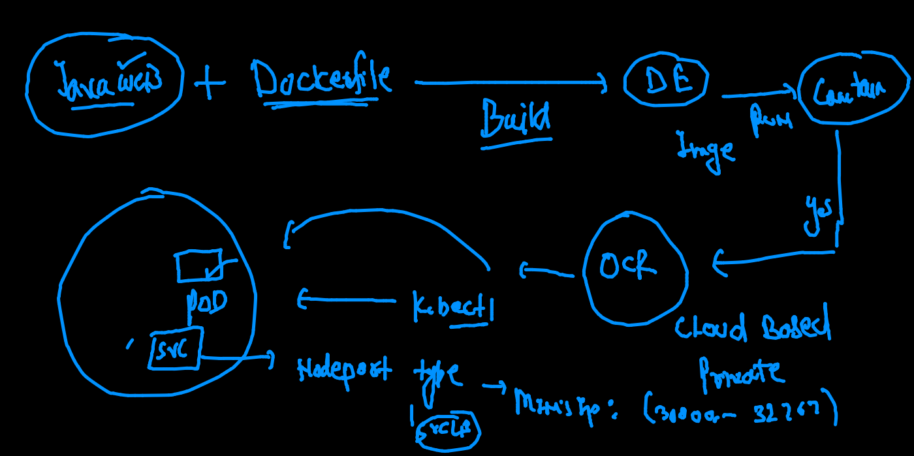
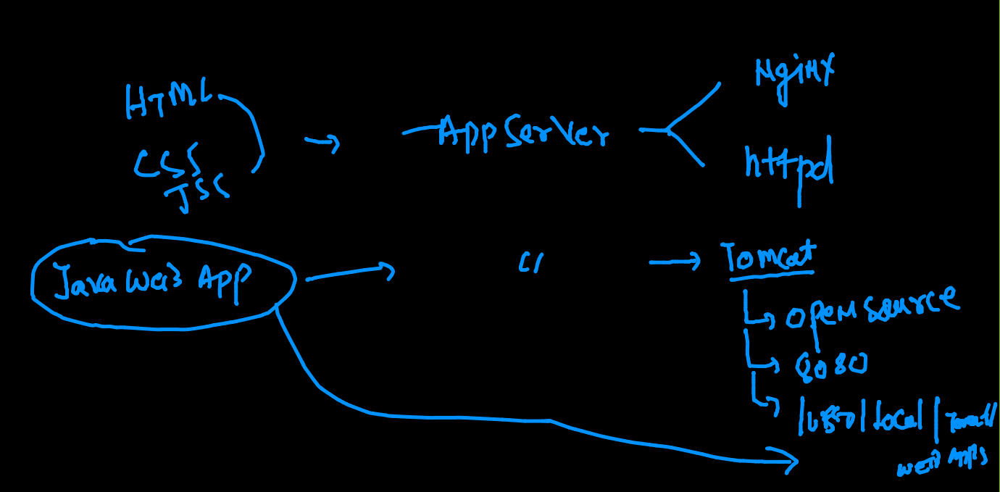
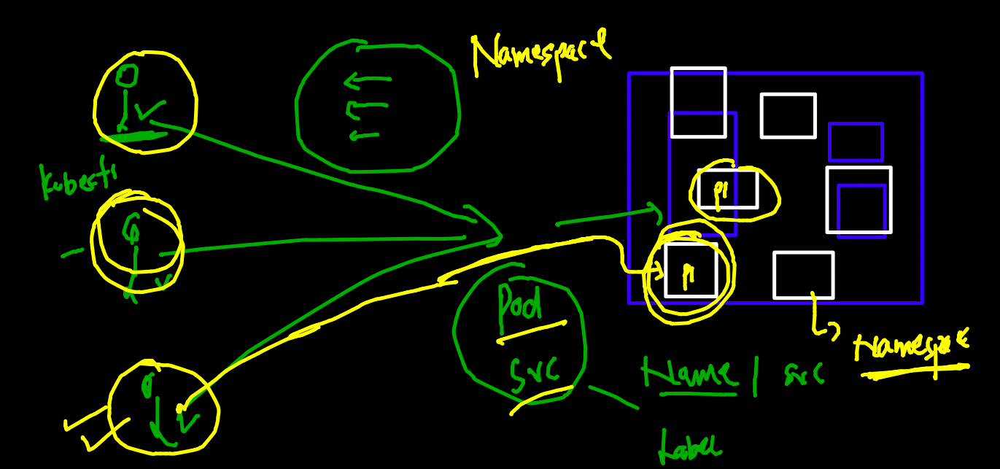
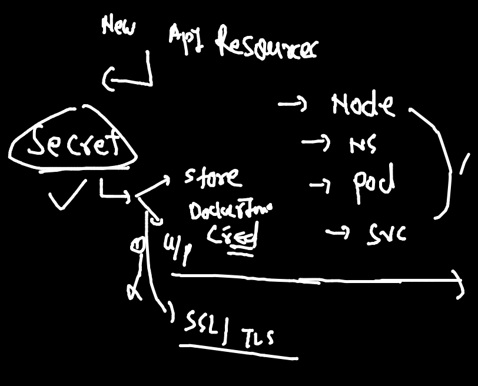

# training docker & kubernetes plan 


## Deploy javaweb in k8s 



## Info about tomcat web server 



### building docker image from github 

```
fire@ashutoshhs-MacBook-Air  ~  docker  build  -t  ashutomcat:webv1  https://github.com/redashu/javawebapp.git  
[+] Building 30.9s (3/8)                                                                                                        
 => [internal] load git source https://github.com/redashu/javawebapp.git                                                   1.4s
 => [internal] load metadata for docker.io/library/tomcat:latest                                                           4.0s 
 => [auth] library/tomcat:pull token for registry-1.docker.io                                                              0.0s 
 => [1/5] FROM docker.io/library/tomcat@sha256:0d985ff1e6cb81cdf3139336d95acb995621a5c79dfb4a705bc18e1e54134164           25.3s 
 => => resolve docker.io/library/tomcat@sha256:0d985ff1e6cb81cdf3139336d95acb995621a5c79dfb4a705bc18e1e54134164            0.0s 
 => => sha256:705bb4cb554eb7751fd21a994f6f32aee582fbe5ea43037db6c43d321763992b 5.15MB / 5.15MB                             8.6s
 => => sha256:0d985ff1e6cb81cdf3139336d95acb995621a5c79dfb4a705bc18e1e54134164 549B / 549B                                 0.0s
 => => sha256:ed3db1dbfce5598b4134a94ad2cc98d3481e827be3fbfaac617d769a9e53c22f 2.42kB / 2.42kB                             0.0s
 => => sha256:519df5fceacdeaadeec563397b1d9f4d7c29c9f6eff879739cab6f0c144f49e1 10.87MB / 10.87MB                          10.9s
 => => sha256:c662ee449a7e796f760eae7a6e9e45cad945ef08738910c9f058b3d63616bd09 12.85kB / 12.85kB                           0.0s
 => => sha256:df5590a8898bedd76f02205dc8caa5cc9863267dbcd8aac038bcd212688c1cc7 35.65MB / 54.93MB                          25.3s
 => => sha256:ccc287cbeddc96a0772397ca00ec85482a7b7f9a9fac643bfddd87b932f743db 19.92MB / 54.57MB                          25.3s
 => => sha256:39a2961e8351d92060fe0b7d3182dd4725fada0faa44b805531195caf32cb6cc 5.42MB / 5.42MB                            16.6s
 => => sha256:0287b7aa7f622adf289f6a1e45d59f58eedc65a4fd4a087fe0cad67d22da4382 211B / 211B                                17.9s
 => => sha256:165d4a436d89e57c90c317fc05e8112e56f6199c6732c9e1473359e8ba0e408d 6.29MB / 203.12MB                          25.3s

```

### testing app 

```
docker  run -itd  --name javaweb -p 1155:8080  df2c9abdb263
5ceab20709e697b12c2f053ae42a260110da4d73a9746fc2f68dba5a825f49b9
 fire@ashutoshhs-MacBook-Air  ~  docker  ps
CONTAINER ID   IMAGE          COMMAND             CREATED         STATUS         PORTS                                       NAMES
5ceab20709e6   df2c9abdb263   "catalina.sh run"   3 seconds ago   Up 2 seconds   0.0.0.0:1155->8080/tcp, :::1155->8080/tcp   javaweb


```

### checking it locally 

```
http://localhost:1155/oracle/
```

### pushing image to docker hub 

```
fire@ashutoshhs-MacBook-Air  ~  docker  tag  df2c9abdb263  dockerashu/tomcat:1stoct2021  
 fire@ashutoshhs-MacBook-Air  ~  
 fire@ashutoshhs-MacBook-Air  ~  
 fire@ashutoshhs-MacBook-Air  ~  docker login -u dockerashu
Password: 
Login Succeeded
 fire@ashutoshhs-MacBook-Air  ~  docker push  dockerashu/tomcat:1stoct2021
The push refers to repository [docker.io/dockerashu/tomcat]
29d11051a6f3: Pushing [==================================================>]   47.1kB
5f70bf18a086: Mounted from dockerashu/finalwebapp 
ea400e6407ed: Pushing  4.608kB
c87d045f4cdf: Mounted from library/tomcat 
10891c98559b: Mounted from library/tomcat 
73819629b437: Waiting 


```

### pushing image OCR 

### tagging 

```
docker  tag   df2c9abdb263  phx.ocir.io/axmbtg8judkl/tomcat:v1

```

### login 

```
fire@ashutoshhs-MacBook-Air  ~  docker login phx.ocir.io 
Username: axmbtg8judkl/learntechbyme@gmail.com
Password: 
Login Succeeded

```

### pushing 

```
docker push  phx.ocir.io/axmbtg8judkl/tomcat:v1 
The push refers to repository [phx.ocir.io/axmbtg8judkl/tomcat]
29d11051a6f3: Preparing 
5f70bf18a086: Preparing 

```

### namespace logic in k8s



### checking namespaces 

```
fire@ashutoshhs-MacBook-Air  ~/Desktop/k8sapps  kubectl  get  namespace
NAME              STATUS   AGE
default           Active   41h
kube-node-lease   Active   41h
kube-public       Active   41h
kube-system       Active   41h
 fire@ashutoshhs-MacBook-Air  ~/Desktop/k8sapps  
 fire@ashutoshhs-MacBook-Air  ~/Desktop/k8sapps  kubectl  get  pods
No resources found in default namespace.
 fire@ashutoshhs-Mac
 
```

### creating custom namespace 

```
fire@ashutoshhs-MacBook-Air  ~/Desktop/k8sapps  kubectl  create  namespace ashu-space 
namespace/ashu-space created
 fire@ashutoshhs-MacBook-Air  ~/Desktop/k8sapps  kubectl  get ns
NAME              STATUS        AGE
ashu-space        Active        15s
default           Active        41h

```

### setting default namespace 

```
kubectl  config  set-context --current --namespace=ashu-space
Context "kubernetes-admin@kubernetes" modified.
 fire@ashutoshhs-MacBook-Air  ~/Desktop/k8sapps  
 fire@ashutoshhs-MacBook-Air  ~/Desktop/k8sapps  
 fire@ashutoshhs-MacBook-Air  ~/Desktop/k8sapps  kubectl  get  po                                             
No resources found in ashu-space namespace.

```

### creating pod of tomcat 

```
 kubectl run  tomcatpod  --image=dockerashu/tomcat:1stoct2021  --port 8080  --dry-run=client -o yaml 
apiVersion: v1
kind: Pod
metadata:
  creationTimestamp: null
  labels:
    run: tomcatpod
  name: tomcatpod
spec:
  containers:
  - image: dockerashu/tomcat:1stoct2021
    name: tomcatpod
    ports:
    - containerPort: 8080
    resources: {}
  dnsPolicy: ClusterFirst
  restartPolicy: Always
status: {}
 fire@ashutoshhs-MacBook-Air  ~/Desktop/k8sapps  kubectl run  tomcatpod  --image=dockerashu/tomcat:1stoct2021  --port 8080  --dry-run=client -o yaml  >tomcatwebapp.yaml
 fire@ashutoshhs-MacBook-Air  ~/Desktop/k8sapps  
 
 ```
 
 ### creating service nodeport yaml 
 
 ```
 fire@ashutoshhs-MacBook-Air  ~/Desktop/k8sapps  kubectl  create service nodeport  ashusvc1     --tcp  1234:8080  --dry-run=client -o yaml 
apiVersion: v1
kind: Service
metadata:
  creationTimestamp: null
  labels:
    app: ashusvc1
  name: ashusvc1
spec:
  ports:
  - name: 1234-8080
    port: 1234
    protocol: TCP
    targetPort: 8080
  selector:
    app: ashusvc1
  type: NodePort
status:
  loadBalancer: {}
  
```

### deploy yaml 

```
fire@ashutoshhs-MacBook-Air  ~/Desktop/k8sapps  kubectl apply -f  tomcatwebapp.yaml 
pod/tomcatpod created
service/ashusvc1 created
 fire@ashutoshhs-MacBook-Air  ~/Desktop/k8sapps  kubectl get  po
NAME        READY   STATUS    RESTARTS   AGE
tomcatpod   1/1     Running   0          7s
 fire@ashutoshhs-MacBook-Air  ~/Desktop/k8sapps  kubectl get  svc
NAME       TYPE       CLUSTER-IP       EXTERNAL-IP   PORT(S)          AGE
ashusvc1   NodePort   10.107.106.204   <none>        1234:32213/TCP   10s

```

### to pull private secure docker image we need to create secret in k8s

### secrets



### creating secret 

```
fire@ashutoshhs-MacBook-Air  ~/Desktop/k8sapps  kubectl  create  secret 
Create a secret using specified subcommand.

Available Commands:
  docker-registry Create a secret for use with a Docker registry
  generic         Create a secret from a local file, directory or literal value
  tls             Create a TLS secret
  
  
  
====

kubectl  create  secret  docker-registry  ashusec111  --docker-server=phx.ocir.io  --docker-username=axmbt    --docker-password='1fVX#AYq<ZvYjN0'

```

### deploying 

```
fire@ashutoshhs-MacBook-Air  ~/Desktop/k8sapps  kubectl replace -f tomcatwebapp.yaml --force
pod "tomcatpod" deleted
service "ashusvc1" deleted
pod/tomcatpod replaced
service/ashusvc1 replaced
 fire@ashutoshhs-MacBook-Air  ~/Desktop/k8sapps  kubectl  get  po
NAME        READY   STATUS    RESTARTS   AGE
tomcatpod   1/1     Running   0          8s
 fire@ashutoshhs-MacBook-Air  ~/Desktop/k8sapps  kubectl  get  svc
NAME       TYPE       CLUSTER-IP      EXTERNAL-IP   PORT(S)          AGE
ashusvc1   NodePort   10.97.189.198   <none>        1234:31119/TCP   11s
 fire@ashutoshhs-MacBook-Air  ~/Desktop/k8sapps  kubectl  get  secret
NAME                  TYPE                                  DATA   AGE
ashusec111            kubernetes.io/dockerconfigjson        1      6m8s
default-token-lkmrz   kubernetes.io/service-account-token   3      73m

```


