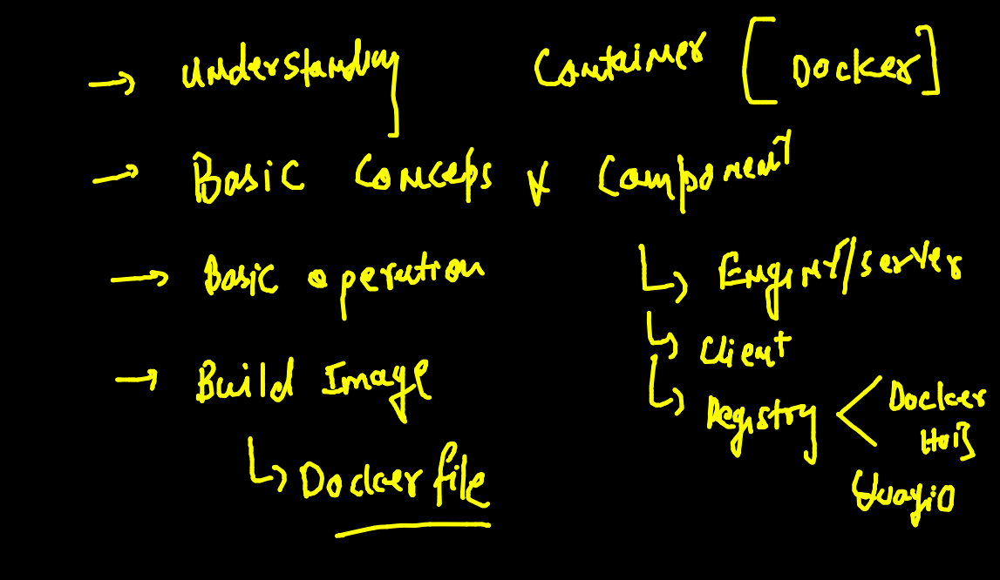
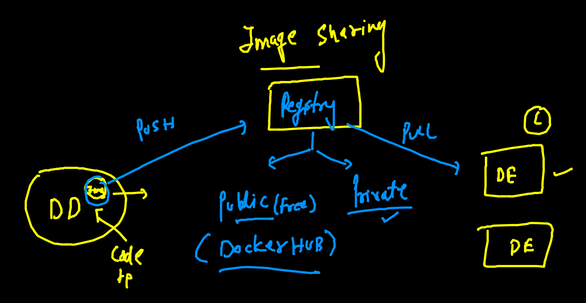
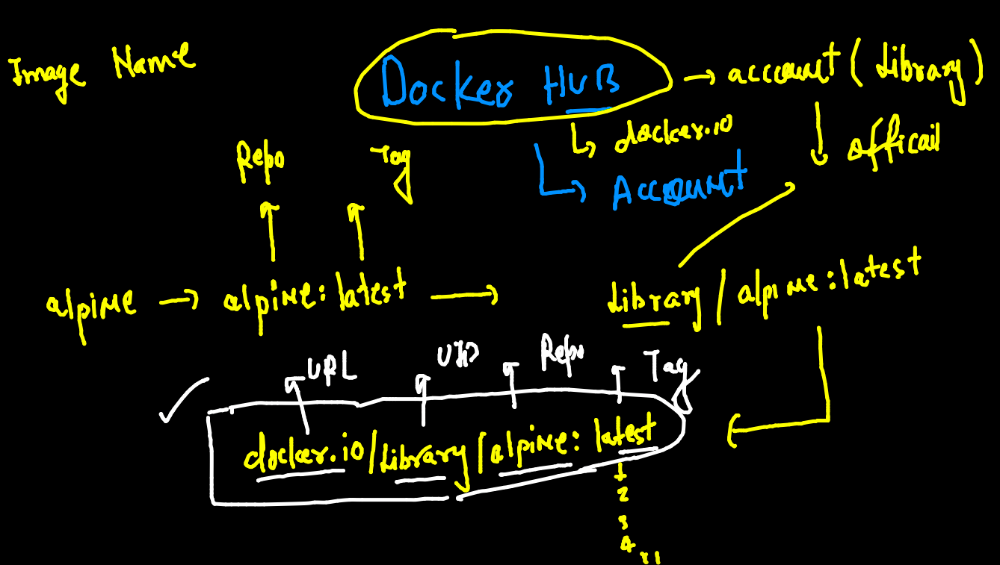
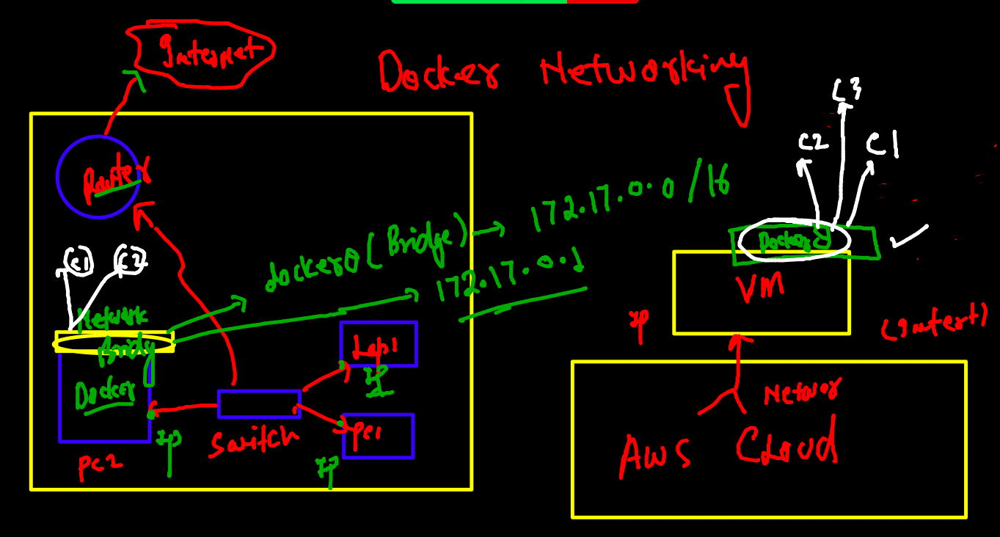
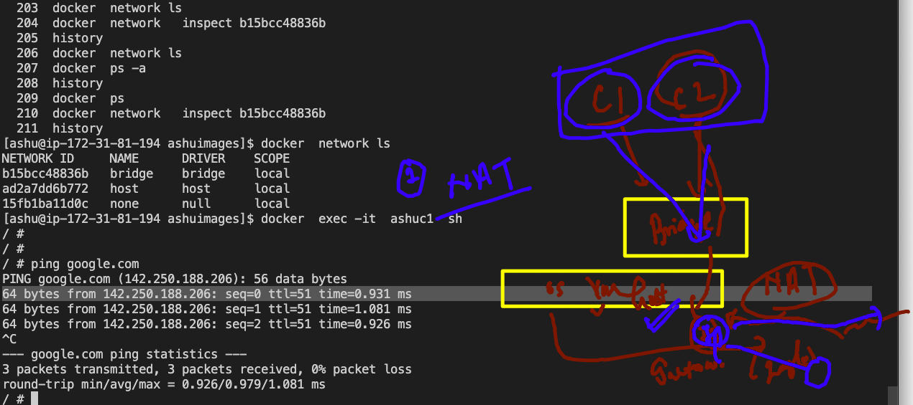
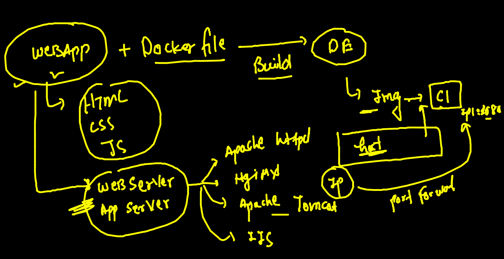
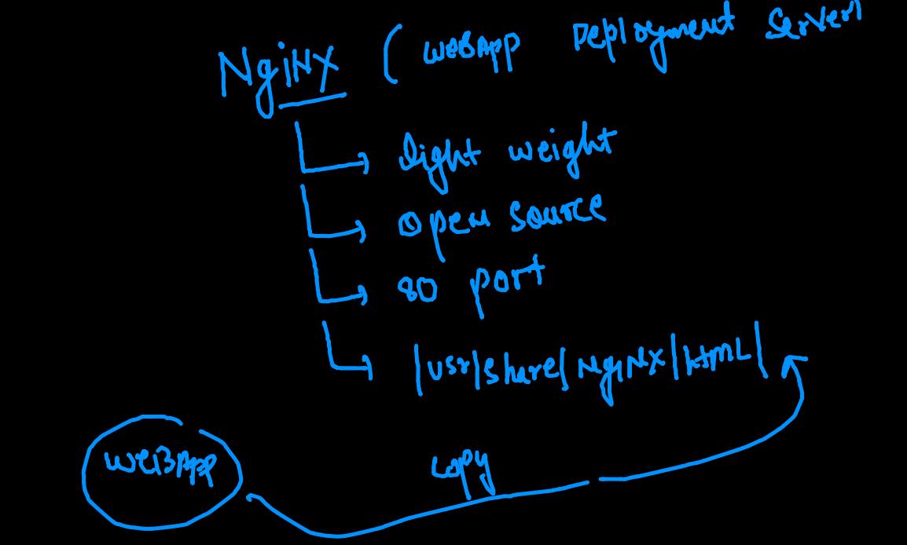
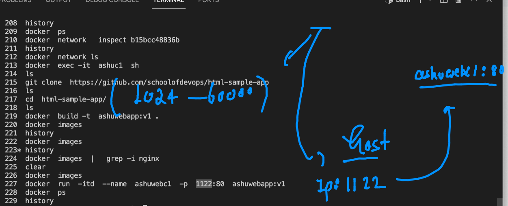

# training docker & kubernetes plan 


## day1 revision 


## quick revision of toc




### building dockerfile  based image 

```
[ashu@ip-172-31-81-194 pythonapp]$ ls
Dockerfile  oracle.py  python.dockerfile
[ashu@ip-172-31-81-194 pythonapp]$ docker  build  -t  ashupython:v2  -f python.dockerfile  . 
Sending build context to Docker daemon  4.608kB
Step 1/6 : FROM python
 ---> a5210955ee89
Step 2/6 : LABEL name=ashutoshh
 ---> Running in af164902965c
Removing intermediate container af164902965c
 ---> a69c0323c413
Step 3/6 : LABEL email=ashutoshh@linux.com
 ---> Running in 8381b7c8c00e
Removing intermediate container 8381b7c8c00e
 ---> 1fbe05de1107
Step 4/6 : RUN  mkdir  /mycode
 ---> Running in 2f22064fd0e2
Removing intermediate container 2f22064fd0e2
 ---> 9c15b31fd8c4
Step 5/6 : COPY oracle.py  /mycode/oracle.py
 ---> f3c1467f4aae
Step 6/6 : CMD  ["python","/mycode/oracle.py"]
 ---> Running in 3fef07533e48
Removing intermediate container 3fef07533e48
 ---> dd2aa7a277d8
Successfully built dd2aa7a277d8
Successfully tagged ashupython:v2

```

###  building java image 

```
[ashu@ip-172-31-81-194 ashuimages]$ cd  javaapp/
[ashu@ip-172-31-81-194 javaapp]$ ls
Dockerfile  hello.java
[ashu@ip-172-31-81-194 javaapp]$ docker  build  -t  ashujava:v1  . 
Sending build context to Docker daemon  3.072kB
Step 1/7 : FROM openjdk
 ---> ff693b5bd1bb
Step 2/7 : LABEL email=ashutoshh@linux.com
 ---> Running in b0bc8d62164d
Removing intermediate container b0bc8d62164d
 ---> df7a12bd0f3e
Step 3/7 : RUN mkdir  /code
 ---> Running in 6946dd324cfb
Removing intermediate container 6946dd324cfb
 ---> e6503795fb99
Step 4/7 : ADD  hello.java  /code/hello.java
 ---> 083f1286fb1d
Step 5/7 : WORKDIR /code
 ---> Running in 18aa8393ec24
Removing intermediate container 18aa8393ec24
 ---> c1bb14be0de9
Step 6/7 : RUN  javac hello.java
 ---> Running in cd4825e22643
Removing intermediate container cd4825e22643
 ---> 10453e65fd2e
Step 7/7 : CMD ["java","myclass"]
 ---> Running in f19f677fe6af
Removing intermediate container f19f677fe6af
 ---> e533a6b006f9
Successfully built e533a6b006f9
Successfully tagged ashujava:v1

```

### creating container 

```
[ashu@ip-172-31-81-194 ashuimages]$ docker  run -it -d --name ashujc1 e533a6b006f9  
21758a46b82dc0bc124bf202ef477758a2c11f3cab98b72299d9d1e61552aad2
[ashu@ip-172-31-81-194 ashuimages]$ docker  ps
CONTAINER ID   IMAGE            COMMAND            CREATED          STATUS          PORTS     NAMES
21758a46b82d   e533a6b006f9     "java myclass"     4 seconds ago    Up 2 seconds              ashujc1
d7fff65e4cca   manjupython:v3   "ping localhost"   14 minutes ago   Up 14 minutes             manjuc4
[ashu@ip-172-31-81-194 ashuimages]$ docker  logs -f  ashujc1 


```

### kill all the running containers

```
[ashu@ip-172-31-81-194 ashuimages]$ docker kill   $(docker  ps  -q)
83e4066daee8
fa5e26da8367
f4a0a9217edf
f6e24b2e0ef5
21758a46b82d
d7fff65e4cca
[ashu@ip-172-31-81-194 ashuimages]$ docker  ps
CONTAINER ID   IMAGE     COMMAND   CREATED   STATUS    PORTS     NAMES

```

### to remove all non running containers

```
[ashu@ip-172-31-81-194 ashuimages]$ docker  rm  $(docker  ps -a  -q)
f465ee98f14e
83e4066daee8
```

## Image sharing 



### docker hub image name reality 



## remove image from docker engine 

```
[ashu@ip-172-31-81-194 ashuimages]$ docker  rmi  alpine
Untagged: alpine:latest
Untagged: alpine@sha256:e1c082e3d3c45cccac829840a25941e679c25d438cc8412c2fa221cf1a824e6a

```

## Pushing image to docker hub 

### tagging 

```
[ashu@ip-172-31-81-194 ashuimages]$ docker  tag  790a07433486  dockerashu/oraclepython:v1 
```

### login to docker hub

```
[ashu@ip-172-31-81-194 ashuimages]$ docker  login  -u  dockerashu 
Password: 
WARNING! Your password will be stored unencrypted in /home/ashu/.docker/config.json.
Configure a credential helper to remove this warning. See
https://docs.docker.com/engine/reference/commandline/login/#credentials-store

Login Succeeded

```

### pushing 

```
[ashu@ip-172-31-81-194 ashuimages]$ docker  push dockerashu/oraclepython:v1
The push refers to repository [docker.io/dockerashu/oraclepython]
3673ba613c8e: Pushed 
7f7f462a944b: Pushed 
4412995ff4d8: Pushed 
e2eb06d8af82: Mounted from library/alpine 
v1: digest: sha256:e5e4492124c337ca1bdc88e02817865dbf361936bee12e26e413e3853a12f097 size: 1154

```

### logout docker hub from terminal 

```
[ashu@ip-172-31-81-194 ashuimages]$ docker  logout 
Removing login credentials for https://index.docker.io/v1/

```

### checking image build history 

```
[ashu@ip-172-31-81-194 ashuimages]$ docker  history  790a07433486 
IMAGE          CREATED       CREATED BY                                      SIZE      COMMENT
790a07433486   2 hours ago   /bin/sh -c #(nop)  CMD ["python3" "/mycode/o…   0B        
92450f2d864a   2 hours ago   /bin/sh -c #(nop) COPY file:6e29d47c004b1169…   231B      
52b7ec80e4e4   2 hours ago   /bin/sh -c mkdir  /mycode                       0B        
9c39eab9f353   2 hours ago   /bin/sh -c apk  add python3                     48.3MB    
137c5896571a   2 hours ago   /bin/sh -c #(nop)  LABEL email=ashutoshh@lin…   0B        
556d0839c01a   2 hours ago   /bin/sh -c #(nop)  LABEL name=ashutoshh         0B        
14119a10abf4   4 weeks ago   /bin/sh -c #(nop)  CMD ["/bin/sh"]              0B        
<missing>      4 weeks ago   /bin/sh -c #(nop) ADD file:aad4290d27580cc1a…   5.6MB 

```

### remove image docker engine 

```
 177  docker  rmi  $(docker  images -q) 
  178  docker  rmi  $(docker  images -q)  -f
  
```

## Docker networking 



### by default all containers in same bridge can connect 

```
[ashu@ip-172-31-81-194 ashuimages]$ docker  inspect   ashuc1  --format='{{.NetworkSettings.IPAddress}}'
172.17.0.2
[ashu@ip-172-31-81-194 ashuimages]$ docker  inspect   ashuc2  --format='{{.NetworkSettings.IPAddress}}'
172.17.0.3
[ashu@ip-172-31-81-194 ashuimages]$ 
[ashu@ip-172-31-81-194 ashuimages]$ docker  exec -it  ashuc1  sh 
/ # ifconfig 
eth0      Link encap:Ethernet  HWaddr 02:42:AC:11:00:02  
          inet addr:172.17.0.2  Bcast:172.17.255.255  Mask:255.255.0.0
          UP BROADCAST RUNNING MULTICAST  MTU:1500  Metric:1
          RX packets:13 errors:0 dropped:0 overruns:0 frame:0
          TX packets:0 errors:0 dropped:0 overruns:0 carrier:0
          collisions:0 txqueuelen:0 
          RX bytes:1030 (1.0 KiB)  TX bytes:0 (0.0 B)

lo        Link encap:Local Loopback  
          inet addr:127.0.0.1  Mask:255.0.0.0
          UP LOOPBACK RUNNING  MTU:65536  Metric:1
          RX packets:676 errors:0 dropped:0 overruns:0 frame:0
          TX packets:676 errors:0 dropped:0 overruns:0 carrier:0
          collisions:0 txqueuelen:1000 
          RX bytes:56784 (55.4 KiB)  TX bytes:56784 (55.4 KiB)

/ # ping  172.17.0.3
PING 172.17.0.3 (172.17.0.3): 56 data bytes
64 bytes from 172.17.0.3: seq=0 ttl=255 time=0.105 ms
64 bytes from 172.17.0.3: seq=1 ttl=255 time=0.085 ms
^C
--- 172.17.0.3 ping statistics ---
2 packets transmitted, 2 packets received, 0% packet loss
round-trip min/avg/max = 0.085/0.095/0.105 ms

```

### more about docker network bridge

```
[ashu@ip-172-31-81-194 ashuimages]$ docker  network ls
NETWORK ID     NAME      DRIVER    SCOPE
b15bcc48836b   bridge    bridge    local
ad2a7dd6b772   host      host      local
15fb1ba11d0c   none      null      local
[ashu@ip-172-31-81-194 ashuimages]$ docker  network   inspect b15bcc48836b
[
    {
        "Name": "bridge",
        "Id": "b15bcc48836b83117fdc2d67cccf4ff78c3e1af10ac3e9c8f7f0c5dbfd8a5998",
        "Created": "2021-09-28T03:56:31.356696114Z",
        "Scope": "local",
        "Driver": "bridge",
        "EnableIPv6": false,
        "IPAM": {
            "Driver": "default",
            "Options": null,
            "Config": [
                {
                    "Subnet": "172.17.0.0/16",
                    "Gateway": "172.17.0.1"
                }
            ]
        },
        "Internal": false,
        "Attachable": false,
        "Ingress": false,
        "ConfigFrom": {
            "Network": ""
        },
        "ConfigOnly": false,
        "Containers": {
            "448ae0c76c399f7182d2cb9b2a82a599263e563711592cbeddaa7cc6a012250d": {
                "Name": "ashuc1",
                "EndpointID": "73253b801bc33a38b4515163112becc792402c1d505fc95bb8005143e061bc6e",
                "MacAddress": "02:42:ac:11:00:02",
                "IPv4Address": "172.17.0.2/16",
                "IPv6Address": ""
            },
            "cc5aa09e6825734ba851f0c1a3dfe805de4294333d28c5a4ff0a385d19f6fc70": {
                "Name": "ashuc2",
                "EndpointID": "a21b2d2058173d909ea5cd80d3e9d4705e64c09ad38e9c55a7342805dbd60f6f",
                "MacAddress": "02:42:ac:11:00:03",
                "IPv4Address": "172.17.0.3/16",
                "IPv6Address": ""
            }
        },
        "Options": {
            "com.docker.network.bridge.default_bridge": "true",
            "com.docker.network.bridge.enable_icc": "true",
            "com.docker.network.bridge.enable_ip_masquerade": "true",
            "com.docker.network.bridge.host_binding_ipv4": "0.0.0.0",
            "com.docker.network.bridge.name": "docker0",
            "com.docker.network.driver.mtu": "1500"
        },
        "Labels": {}
    }
]

```

### NAT in Docker 



## POrtwarding in Docker host 

### building webapp with appserver 



### Nginx webapp server 



### cloning webapp

```
git clone  https://github.com/schoolofdevops/html-sample-app

```

### building image 

```
[ashu@ip-172-31-81-194 ashuimages]$ cd  html-sample-app/
[ashu@ip-172-31-81-194 html-sample-app]$ ls
assets      elements.html  html5up-phantom.zip  index.html   README.txt
Dockerfile  generic.html   images               LICENSE.txt
[ashu@ip-172-31-81-194 html-sample-app]$ docker  build -t  ashuwebapp:v1 . 
Sending build context to Docker daemon  2.099MB
Step 1/3 : FROM nginx
latest: Pulling from library/nginx
07aded7c29c6: Pull complete 
bbe0b7acc89c: Pull complete 
44ac32b0bba8: Pull complete 
91d6e3e593db: Pull complete 
8700267f2376: Pull complete 
4ce73aa6e9b0: Pull complete 
Digest: sha256:969419c0b7b0a5f40a4d666ad227360de5874930a2b228a7c11e15dedbc6e092
Status: Downloaded newer image for nginx:latest
 ---> f8f4ffc8092c
Step 2/3 : LABEL email=ashutoshh@linux.com
 ---> Running in 7a66f1020f8f
Removing intermediate container 7a66f1020f8f
 ---> 314c3cb166f3
Step 3/3 : COPY . /usr/share/nginx/html/
 ---> 2d9f90c01e29
Successfully built 2d9f90c01e29
Successfully tagged ashuwebapp:v1

```

### creating container with port forwarding rule 



### Custom bridge 


### creating a bridge with DNS features only but not static IP address

```
[ashu@ip-172-31-81-194 ashuimages]$ docker  network create  ashubr1 
39496c514f996000a39bd9ddd605f0c7235b0736291b51e83be48415886568c9
[ashu@ip-172-31-81-194 ashuimages]$ docker network  ls
NETWORK ID     NAME      DRIVER    SCOPE
39496c514f99   ashubr1   bridge    local
b15bcc48836b   bridge    bridge    local
ad2a7dd6b772   host      host      local
15fb1ba11d0c   none      null      local
[ashu@ip-172-31-81-194 ashuimages]$ docker network  inspect ashubr1
[
    {
        "Name": "ashubr1",
        "Id": "39496c514f996000a39bd9ddd605f0c7235b0736291b51e83be48415886568c9",
        "Created": "2021-09-28T11:17:57.960510617Z",
        "Scope": "local",
        "Driver": "bridge",
        "EnableIPv6": false,
        "IPAM": {
            "Driver": "default",
            "Options": {},
            "Config": [
                {
                    "Subnet": "172.18.0.0/16",
                    "Gateway": "172.18.0.1"
                }
            ]
        },
        "Internal": false,
        "Attachable": false,
        "Ingress": false,
        "ConfigFrom": {
            "Network": ""
        },
        "ConfigOnly": false,
        "Containers": {},
        "Options": {},
        "Labels": {}
    }
]

```

### checking container connection 

```
[ashu@ip-172-31-81-194 ashuimages]$ docker  run -itd --name ashuxc1 --network  ashubr1 alpine ping localhost 
38b4c61403d1011643e325e3c6023e24749f3de29daedd9a8e5c5247f94f544c
[ashu@ip-172-31-81-194 ashuimages]$ 
[ashu@ip-172-31-81-194 ashuimages]$ 
[ashu@ip-172-31-81-194 ashuimages]$ docker  run -itd --name ashuxc2 --network  ashubr1 alpine ping localhost 
650f88101f42f7ecae7c92a2d570701fa01c3cb9a40019306d3699e94df5f8ef
[ashu@ip-172-31-81-194 ashuimages]$ docker  exec -it ashuxc2  sh 
/ # 
/ # ping ashuxc1
PING ashuxc1 (172.18.0.2): 56 data bytes
64 bytes from 172.18.0.2: seq=0 ttl=255 time=0.118 ms
64 bytes from 172.18.0.2: seq=1 ttl=255 time=0.093 ms
^C
--- ashuxc1 ping statistics ---
2 packets transmitted, 2 packets received, 0% packet loss
round-trip min/avg/max = 0.093/0.105/0.118 ms
/ # exit

```

### creating bridge with DNS and static subnet 

```
 247  docker  network create  ashubr2  --subnet  192.168.10.0/24 
  248  docker  run -itd --name ashuxc3 --network  ashubr2 alpine ping localhost 
  249  docker  run -itd --name ashuxc4 --network  ashubr2 --ip  192.168.10.100  alpine ping localhost 
  250  history 
[ashu@ip-172-31-81-194 ashuimages]$ docker  exec -it ashuxc3  sh 
/ # ping ashuxc4
PING ashuxc4 (192.168.10.100): 56 data bytes
64 bytes from 192.168.10.100: seq=0 ttl=255 time=0.120 ms
64 bytes from 192.168.10.100: seq=1 ttl=255 time=0.103 ms
64 bytes from 192.168.10.100: seq=2 ttl=255 time=0.102 ms
^C
--- ashuxc4 ping statistics ---
3 packets transmitted, 3 packets received, 0% packet loss
round-trip min/avg/max = 0.102/0.108/0.120 ms
/ # exit

```


