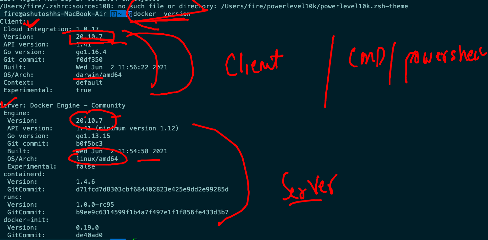
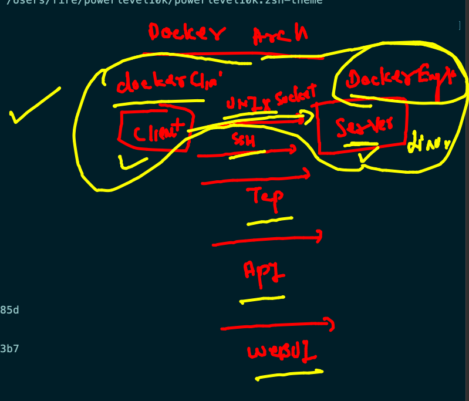
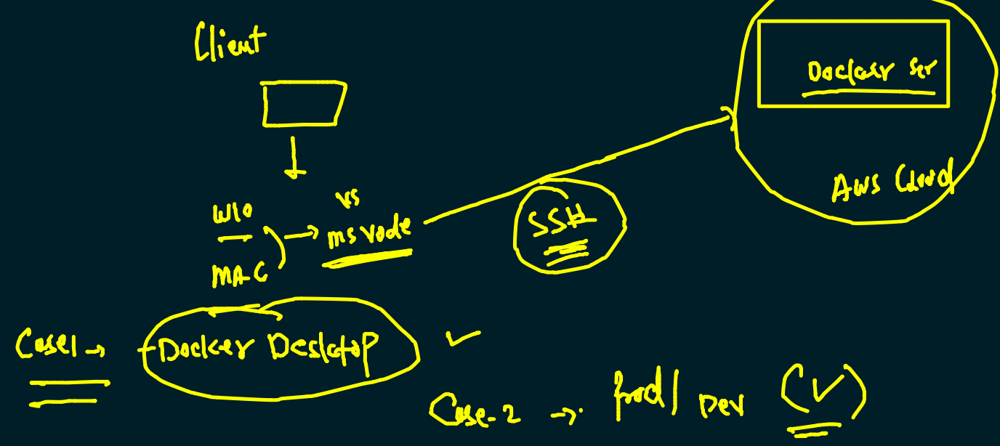
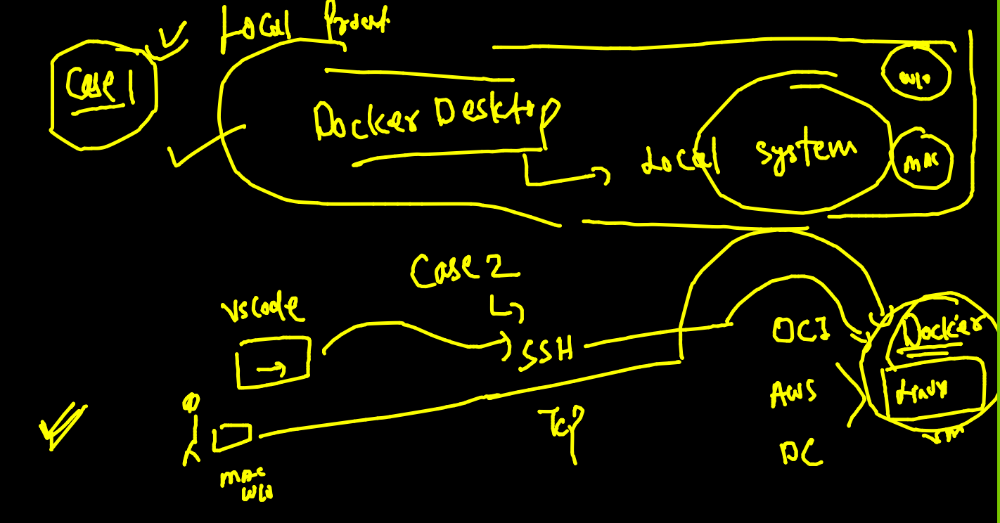
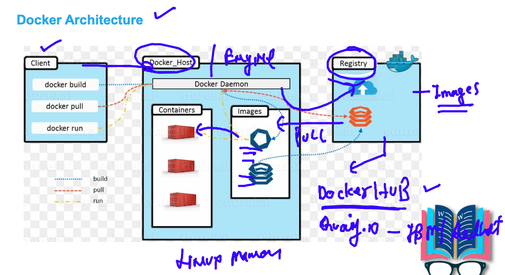
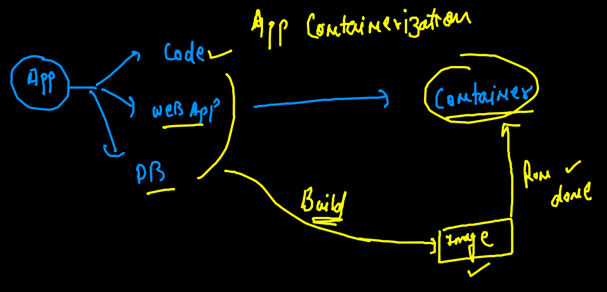
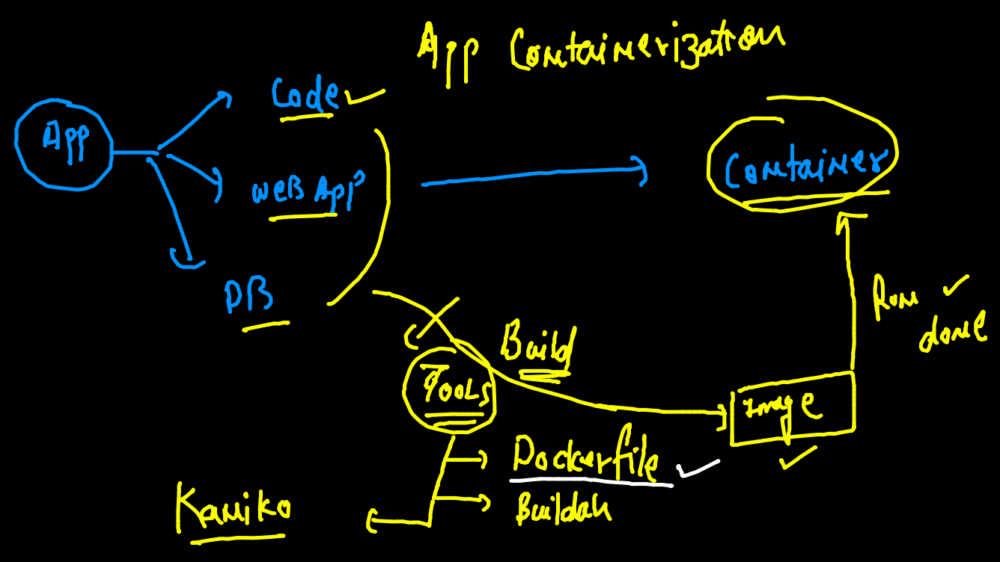
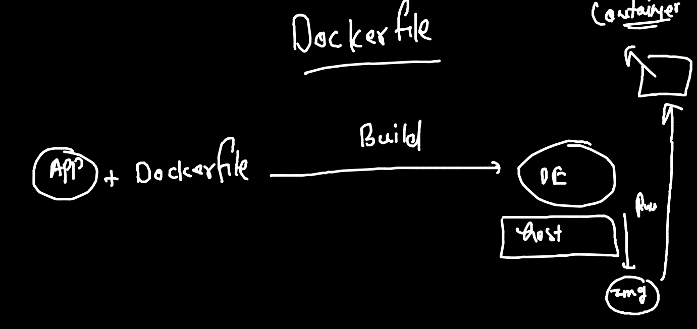

# training docker & kubernetes plan 


## some assumption 


## app deployment / compatilibity 


## physical machines replaced with virtual machine 


## problem with VM concept 


## Solution is container


## Understanding OS 


## what is container 


## cre vs vm


## Docker info 

### installation info 


## Docker Desktop in windows / mac system 


## Installing docker Dekstop on MAC OS

### Download link 

[Link](https://hub.docker.com/editions/community/docker-ce-desktop-mac)

## Installing docker Dekstop on Windows 10 

[LInk]

## what exactly docker Dekstop do on a linux VM 

```
[root@ip-172-31-81-194 ~]# history 
    1  yum   install  docker  -y  # same OL / RHEL 
    2  history 
[root@ip-172-31-81-194 ~]# 
[root@ip-172-31-81-194 ~]# 
[root@ip-172-31-81-194 ~]# systemctl start  docker 
[root@ip-172-31-81-194 ~]# systemctl enable  docker 
Created symlink from /etc/systemd/system/multi-user.target.wants/docker.service to /usr/lib/systemd/system/docker.service.
[root@ip-172-31-81-194 ~]# systemctl status  docker 
● docker.service - Docker Application Container Engine
   Loaded: loaded (/usr/lib/systemd/system/docker.service; enabled; vendor preset: disabled)
   Active: active (running) since Mon 2021-09-27 06:30:37 UTC; 13s ago
     Docs: https://docs.docker.com
 Main PID: 3661 (dockerd)
   CGroup: /system.slice/docker.service
           └─3661 /usr/bin/dockerd -H fd:// --containerd=/run/containerd/containerd.sock --default-ulimit nofile=32768:65536

Sep 27 06:30:36 ip-172-31-81-194.ec2.internal dockerd[3661]: time="2021-09-27T06:30:36.823592857Z" level=info msg="scheme...grpc
Sep 27 06:30:36 ip-172-31-81-194.ec2.internal dockerd[3661]: time="2021-09-27T06:30:36.823609934Z" level=info msg="ccReso...grpc
Sep 27 06:30:36 ip-172-31-81-194.ec2.internal dockerd[3661]: time="2021-09-27T06:30:36.823621298Z" level=info msg="Client...grpc
Sep 27 06:30:36 ip-172-31-81-194.ec2.internal dockerd[3661]: time="2021-09-27T06:30:36.874689834Z" level=info msg="Loadin...rt."
Sep 27 06:30:37 ip-172-31-81-194.ec2.internal dockerd[3661]: time="2021-09-27T06:30:37.374241727Z" level=info msg="Defaul...ess"
Sep 27 06:30:37 ip-172-31-81-194.ec2.internal dockerd[3661]: time="2021-09-27T06:30:37.593818203Z" level=info msg="Loadin...ne."
Sep 27 06:30:37 ip-172-31-81-194.ec2.internal dockerd[3661]: time="2021-09-27T06:30:37.648980283Z" level=info msg="Docker...10.7
Sep 27 06:30:37 ip-172-31-81-194.ec2.internal dockerd[3661]: time="2021-09-27T06:30:37.649091188Z" level=info msg="Daemon...ion"
Sep 27 06:30:37 ip-172-31-81-194.ec2.internal systemd[1]: Started Docker Application Container Engine.
Sep 27 06:30:37 ip-172-31-81-194.ec2.internal dockerd[3661]: time="2021-09-27T06:30:37.690919057Z" level=info msg="API li...ock"
Hint: Some lines were ellipsized, use -l to show in full

```

### official link to Install docker on different OS Platform 

[link_install](https://docs.docker.com/engine/install/)

### Docker Version checking 



## How docker client connect with Docker server 




## Connecting docker Engine remotely 



## Docker REmote engine connect 



## Understanding vm and container creation 


## Docker images can be downloaded from registry server 



## Basic Docker operations 

### checking images on docker server 

```
ashu@ip-172-31-81-194 ~]$ docker  images
REPOSITORY   TAG       IMAGE ID   CREATED   SIZE
[ashu@ip-172-31-81-194 ~]$ 

```

### searching docker images

```
[ashu@ip-172-31-81-194 ~]$ docker  search  python
NAME                             DESCRIPTION                                     STARS     OFFICIAL   AUTOMATED
python                           Python is an interpreted, interactive, objec…   6566      [OK]       
pypy                             PyPy is a fast, compliant alternative implem…   287       [OK]       
nikolaik/python-nodejs           Python with Node.js                             84                   [OK]
joyzoursky/python-chromedriver   Python with Chromedriver, for running automa…   59                   [OK]
arm32v7/python                   Python is an interpreted, interactive, objec…   58                   
centos/python-35-centos7         Platform for building and running Python 3.5…   39                   
hylang                           Hy is a Lisp dialect that translates express…   37        [OK]       
centos/python-36-centos7         Platform for building and running Python 3.6…   33                   
arm64v8/python                   Python is an interpreted, interactive, objec…   25                   
revolutionsystems/python         Optimized Python Images                         19                   
centos/python-27-centos7         Platform for building and running Python 2.7…   18                   
publicisworldwide/python-conda   Basic Python environments with Conda.           6                    [OK]

```

### pulling first docker image

```
[ashu@ip-172-31-81-194 ~]$ docker  pull   oraclelinux:8.4  
8.4: Pulling from library/oraclelinux
2d6c3304745e: Pull complete 
Digest: sha256:dc85aba362d09f1d9e4c08210f02a43f7e6306325a6d32b22df79af5338a48bb
Status: Downloaded newer image for oraclelinux:8.4
docker.io/library/oraclelinux:8.4
[ashu@ip-172-31-81-194 ~]$ 
[ashu@ip-172-31-81-194 ~]$ docker  images
REPOSITORY    TAG       IMAGE ID       CREATED       SIZE
oraclelinux   8.4       fcf3cbfc22ac   6 weeks ago   247MB

```

### all pulled images 

```
[ashu@ip-172-31-81-194 ~]$ docker images
REPOSITORY    TAG       IMAGE ID       CREATED       SIZE
python        latest    a5210955ee89   2 weeks ago   911MB
alpine        latest    14119a10abf4   4 weeks ago   5.6MB
openjdk       latest    ff693b5bd1bb   6 weeks ago   471MB
oraclelinux   8.4       fcf3cbfc22ac   6 weeks ago   247MB

```

### Understanding container creation process


### checking docker server info 

```
[ashu@ip-172-31-81-194 ~]$ docker  info  
Client:
 Context:    default
 Debug Mode: false

Server:
 Containers: 0
  Running: 0
  Paused: 0
  Stopped: 0
 Images: 5
 Server Version: 20.10.7
 Storage Driver: overlay2
  Backing Filesystem: xfs
  Supports d_type: true
  Native Overlay Diff: true
  userxattr: false
 Logging Driver: json-file
 Cgroup Driver: cgroupfs
 Cgroup Version: 1
 Plugins:
  Volume: local
  Network: bridge host ipvlan macvlan null overlay
  Log: awslogs fluentd gcplogs gelf journald json-file local logentries splunk syslog
 Swarm: inactive
 Runtimes: io.containerd.runc.v2 io.containerd.runtime.v1.linux runc
 Default Runtime: runc
 Init Binary: docker-init
 containerd version: d71fcd7d8303cbf684402823e425e9dd2e99285d
 runc version: %runc_commit
 init version: de40ad0
 Security Options:
  seccomp
   Profile: default
 Kernel Version: 4.14.243-185.433.amzn2.x86_64
 Operating System: Amazon Linux 2
 OSType: linux
 Architecture: x86_64
 CPUs: 2
 Total Memory: 7.788GiB
 Name: ip-172-31-81-194.ec2.internal
 ID: YXG5:XAHQ:RSLI:MNJ4:UZOK:OSNS:HA6Y:HIIB:7R4B:A6YQ:P3CB:CBGY
 Docker Root Dir: /var/lib/docker
 
 ```
 
 ### creating first alpine image container 
 
 ```
 [ashu@ip-172-31-81-194 ~]$ docker run   --name  ashuc1   -d    alpine:latest      ping  localhost 
7efcce101667071f4982153bfe16dfebdc02dbba6728ee61e5b8f111ef18a5cb
[ashu@ip-172-31-81-194 ~]$ 

```

### list of running container 

```
[ashu@ip-172-31-81-194 ~]$ docker  ps
CONTAINER ID   IMAGE           COMMAND            CREATED          STATUS          PORTS     NAMES
7efcce101667   alpine:latest   "ping localhost"   17 seconds ago   Up 16 seconds             ashuc1
[ashu@ip-172-31-81-194 ~]$ 

```

### checking resource consumption by container 

```
[ashu@ip-172-31-81-194 ~]$ docker  stats  ashuc1  

CONTAINER ID   NAME      CPU %     MEM USAGE / LIMIT   MEM %     NET I/O       BLOCK I/O   PIDS
7efcce101667   ashuc1    0.01%     696KiB / 7.788GiB   0.01%     1.21kB / 0B   0B / 0B     1

```

### checking output of a running container output 

```
33  docker  logs  ashuc1  
   34  docker  logs  -f  ashuc1  
   
```

### stop a running container manually 

```
[ashu@ip-172-31-81-194 ~]$ docker   stop   ashuc1 
ashuc1
[ashu@ip-172-31-81-194 ~]$ docker  ps
CONTAINER ID   IMAGE           COMMAND            CREATED          STATUS          PORTS     NAMES
f3ac81bfc1cb   alpine:latest   "ping localhost"   7 minutes ago    Up 7 minutes              vinuthacont1
758233d59f00   alpine:latest   "ping localhost"   7 minutes ago    Up 7 minutes              ashutoshc1
87aaff709f3c   alpine:latest   "ping localhost"   7 minutes ago    Up 7 minutes              arun0
99a3b131355b   alpine:latest   "ping localhost"   7 minutes ago    Up 7 minutes              sanjay
79991cc7c45a   alpine:latest   "ping localhost"   9 minutes ago    Up 9 minutes              manjuc1
7c68c3e8c53f   alpine:latest   "ping localhost"   10 minutes ago   Up 10 minutes             mallik
7bfce7e9f73d   alpine:latest   "ping localhost"   10 minutes ago   Up 10 minutes             phani1
4cf4c39f7929   alpine:latest   "ping localhost"   11 minutes ago   Up 11 minutes             preeti1
5d4c630d05b0   alpine:latest   "ping localhost"   11 minutes ago   Up 11 minutes             anshul1

```

### starting same container 

```
[ashu@ip-172-31-81-194 ~]$ docker  start  ashuc1
ashuc1
[ashu@ip-172-31-81-194 ~]$ docker  ps
CONTAINER ID   IMAGE           COMMAND            CREATED          STATUS         PORTS     NAMES
99a3b131355b   alpine:latest   "ping localhost"   9 minutes ago    Up 9 minutes             sanjay
7efcce101667   alpine:latest   "ping localhost"   14 minutes ago   Up 3 seconds             ashuc1

```

### to run a child process 

```
48  docker  exec  ashuc1   date 
   49  docker  ps
   50  docker  exec  ashuc1   uname -r
   51  docker  exec  ashuc1  cal 
   
```

### login to a running container 

```
[ashu@ip-172-31-81-194 ~]$ docker  exec  -it  ashuc1   sh  
/ # 
/ # 
/ # date
Mon Sep 27 10:02:07 UTC 2021
/ # uname
Linux
/ # uname -r
4.14.243-185.433.amzn2.x86_64
/ # exit

```

### forcefully stop container 

```
[ashu@ip-172-31-81-194 ~]$ docker  kill  ashuc1  # forcefully stop 
ashuc1

```

### remove a stopped container 

```
ashu@ip-172-31-81-194 ~]$ docker  kill  ashuc1  # forcefully stop 
ashuc1
[ashu@ip-172-31-81-194 ~]$ docker  rm  ashuc1 
ashuc1
[ashu@ip-172-31-81-194 ~]$ docker  ps  -a
CONTAINER ID   IMAGE            COMMAND                CREATED          STATUS                        PORTS     NAMES
2e64d91083a0   alpine:latest    "ping localhost"       5 minutes ago    Up 2 minutes                            pujitha1
f3ac81bfc1cb   alpine:latest    "ping localhost"       18 minutes ago   Up 8 minutes                            vinuthacont1
758233d59f00   alpine:latest    "ping localhost"       18 minutes ago   Up 8 minutes                            ashutoshc1
87aaff709f3c   alpine:latest    "ping localhost"       18 minutes ago   Up 7 minutes                            arun0
99a3b131355b   alpine:latest    "ping localhost"       18 minutes ago   Up 6 minutes                            sanjay
751355e9eaaa   alpine:latest    "ping localhost --d"   19 minutes ago   Exited (1) 19 minutes ago               arun3
fd6166baae46   alpine:latest    "ping localhost -d"    19 minutes ago   Exited (1) 19 minutes ago               arun2
452a2cf6a2f6   openjdk:latest   "ping localhost"       20 minutes ago   Created                                 vinutha1
4c59891f448c   alpine:latest    "ping localhost"       20 minutes ago   Exited (0) 20 minutes ago               arun1
79991cc7c45a   alpine:latest    "ping localhost"       20 minutes ago   Up 8 minutes                            manjuc1
7c68c3e8c53f   alpine:latest    "ping localhost"       21 minutes ago   Up 7 minutes                            mallik
78b41a2abc3a   openjdk:latest   "ping:localhost"       21 minutes ago   Created                                 vinuthac1
d44656649e54   alpine:latest    "ls"                   21 minutes ago   Exited (0) 21 minutes ago               arun
7bfce7e9f73d   alpine:latest    "ping localhost"       21 minutes ago   Up 8 minutes                            phani1
9b8dabb64d10   alpine:latest    "ping localhost"       21 minutes ago   Up 8 minutes                            ankurC1
4cf4c39f7929   alpine:latest    "ping localhost"       22 minutes ago   Up 5 minutes                            preeti1
5d4c630d05b0   alpine:latest    "ping localhost"       22 minutes ago   Exited (137) 10 seconds ago             anshul1

```

## application containerization 



## Intro to docker image building tools 




### Understanding dockerfile 



### building first docker image

```
[ashu@ip-172-31-81-194 ashuimages]$ ls
cppapp  javaapp  pythonapp
[ashu@ip-172-31-81-194 ashuimages]$ cd pythonapp
[ashu@ip-172-31-81-194 pythonapp]$ ls
Dockerfile  oracle.py
[ashu@ip-172-31-81-194 pythonapp]$ docker  build  -t  ashupython:v1  . 
Sending build context to Docker daemon  3.584kB
Step 1/7 : FROM oraclelinux:8.4
 ---> fcf3cbfc22ac
Step 2/7 : LABEL name=ashutoshh
 ---> Running in acce45e6c913
Removing intermediate container acce45e6c913
 ---> a13ddd057644
Step 3/7 : LABEL email=ashutoshh@linux.com
 ---> Running in 8637824ab757
Removing intermediate container 8637824ab757
 ---> c5a18c32933f
Step 4/7 : RUN  yum  install python3 -y
 ---> Running in b00345abf59d
Oracle Linux 8 BaseOS Latest (x86_64)            74 MB/s |  36 MB     00:00    
Oracle Linux 8 Application Stream (x86_64)       71 MB/s |  27 MB     00:00    

```

### creating container 

```
[ashu@ip-172-31-81-194 pythonapp]$ docker  run  -it  -d  --name ashuc2   ashupython:v1  
7c06a33711e271204b5a5ef5eb81601b3a5e709b2733c7ce29e741c717ccfba4
[ashu@ip-172-31-81-194 pythonapp]$ docker  ps
CONTAINER ID   IMAGE           COMMAND                  CREATED             STATUS             PORTS     NAMES
7c06a33711e2   ashupython:v1   "python3 /mycode/ora…"   3 seconds ago       Up 3 seconds                 ashuc2

```


