# training docker & kubernetes plan 


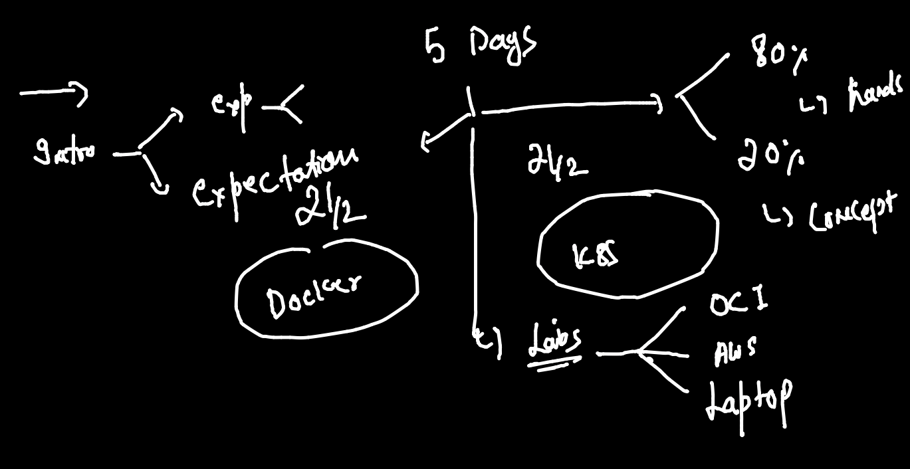

## till day3 revision 

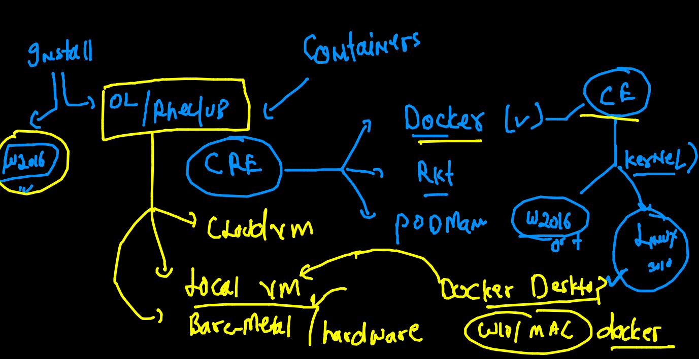


### k8s master auth process
 
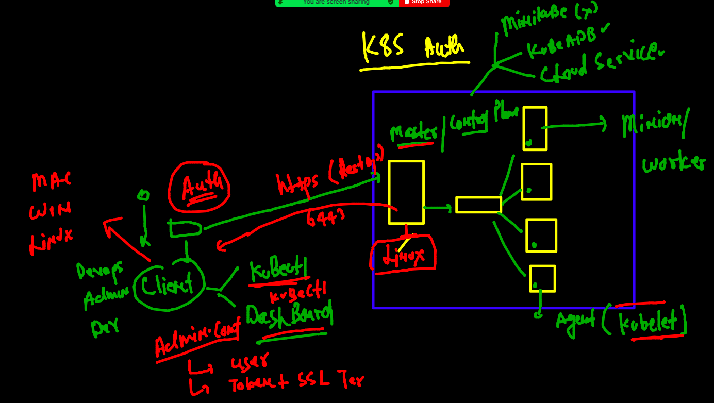

### checking client side software to connect k8s master 

```
kubectl  version --client 
Client Version: version.Info{Major:"1", Minor:"21", GitVersion:"v1.21.1", GitCommit:"5e58841cce77d4bc13713ad2b91fa0d961e69192", GitTreeState:"clean", BuildDate:"2021-05-12T14:18:45Z", GoVersion:"go1.16.4", Compiler:"gc", Platform:"darwin/amd64"}
```

### checking connection to master node 

```
 fire@ashutoshhs-MacBook-Air  ~/Desktop  kubectl  get  nodes  --kubeconfig admin.conf 
NAME         STATUS   ROLES                  AGE   VERSION
masternode   Ready    control-plane,master   17h   v1.22.2
minion1      Ready    <none>                 17h   v1.22.2
minion2      Ready    <none>                 17h   v1.22.2

```

### updating admin.conf to home directory of client users

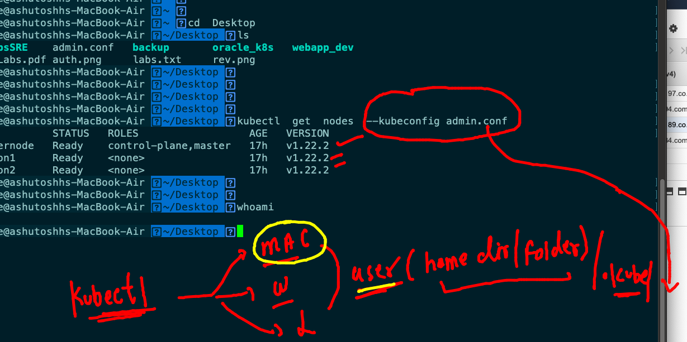

## k8s master node components 

### kube-apiserver 

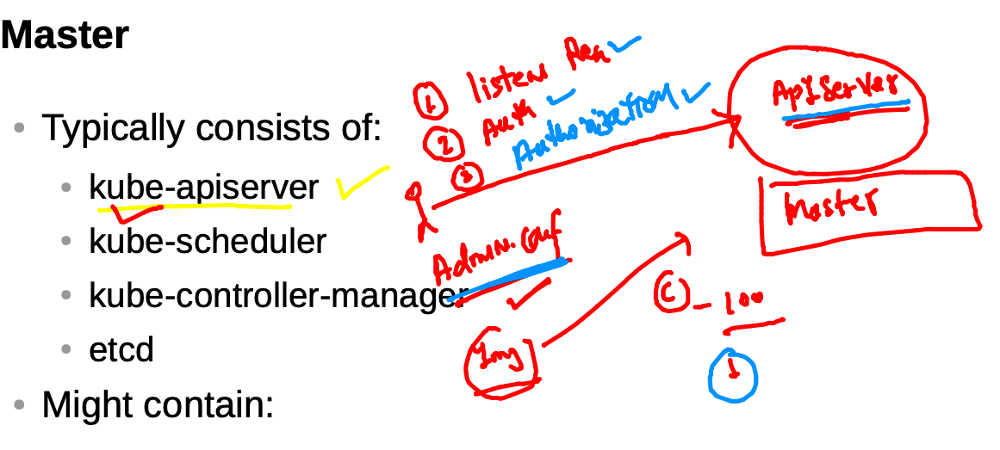

### kube-schedular 

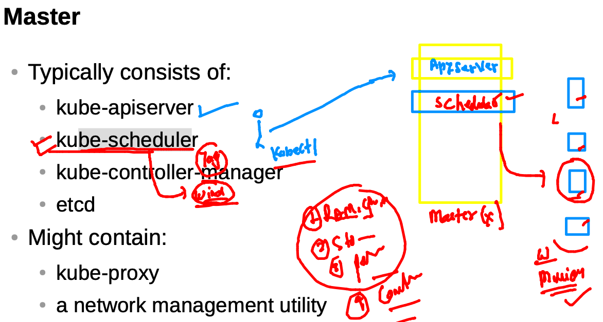

### the brain of k8s master is ETCD (Nosql db) key: value type

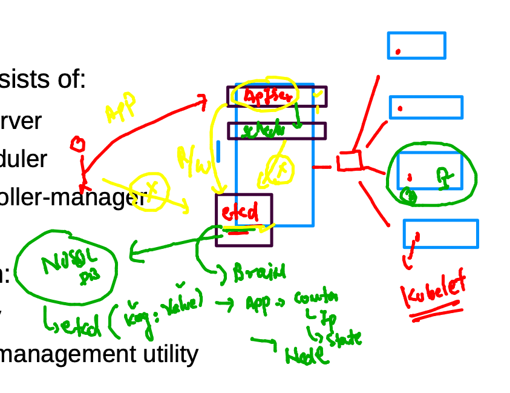

## Intro to POD

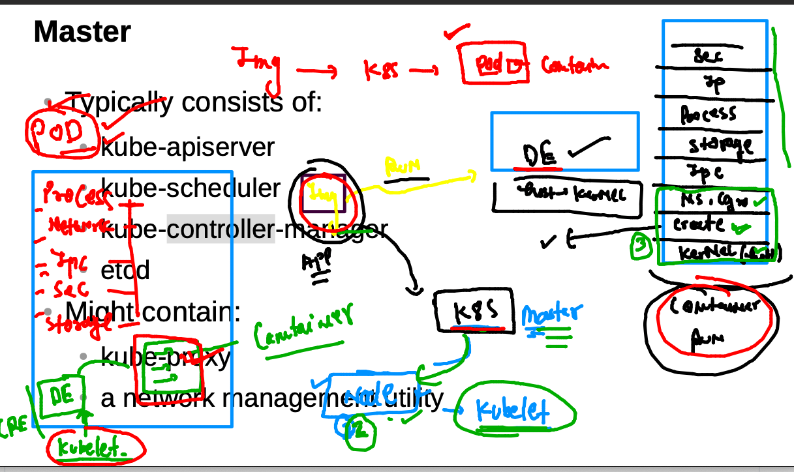


### creating pod file instructions 

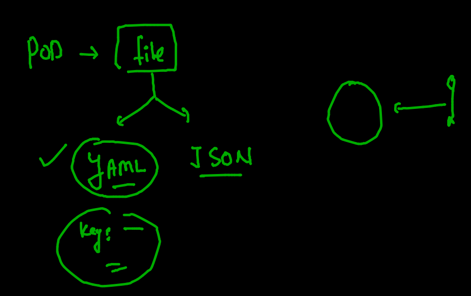

### POD creation using yaml 

### checking syntax 

```
fire@ashutoshhs-MacBook-Air  ~/Desktop/k8sapps  ls
ashupod1.yaml
 fire@ashutoshhs-MacBook-Air  ~/Desktop/k8sapps  kubectl  apply -f ashupod1.yaml  --dry-run
W0930 11:42:56.140800    4171 helpers.go:557] --dry-run is deprecated and can be replaced with --dry-run=client.
pod/ashupod-1 created (dry run)
 fire@ashutoshhs-MacBook-Air  ~/Desktop/k8sapps  
 fire@ashutoshhs-MacBook-Air  ~/Desktop/k8sapps  kubectl  apply -f ashupod1.yaml  --dry-run=client
pod/ashupod-1 created (dry run)

```


### deploying pod 

```
fire@ashutoshhs-MacBook-Air  ~/Desktop/k8sapps  kubectl  apply -f ashupod1.yaml           
pod/ashupod-1 created
 fire@ashutoshhs-MacBook-Air  ~/Desktop/k8sapps  kubectl  get  pods
NAME         READY   STATUS    RESTARTS   AGE
anshulpod    1/1     Running   0          24s
ashupod-1    1/1     Running   0          38s
manjupod-1   1/1     Running   0          33s
vinpod-1     1/1     Running   0          21s

```

### checking more details about pod 

```
fire@ashutoshhs-MacBook-Air  ~/Desktop/k8sapps  kubectl  get  no   
NAME         STATUS   ROLES                  AGE   VERSION
masternode   Ready    control-plane,master   19h   v1.22.2
minion1      Ready    <none>                 19h   v1.22.2
minion2      Ready    <none>                 19h   v1.22.2
 fire@ashutoshhs-MacBook-Air  ~/Desktop/k8sapps  kubectl  get  po  ashupod-1
NAME        READY   STATUS    RESTARTS   AGE
ashupod-1   1/1     Running   0          3m21s
 fire@ashutoshhs-MacBook-Air  ~/Desktop/k8sapps  kubectl  get  po  ashupod-1  -o wide
NAME        READY   STATUS    RESTARTS   AGE     IP             NODE      NOMINATED NODE   READINESS GATES
ashupod-1   1/1     Running   0          3m27s   192.168.34.1   minion1   <none>           <none>

```

### checking all pods info 

```
fire@ashutoshhs-MacBook-Air  ~/Desktop/k8sapps  kubectl  get  po    -o wide
NAME            READY   STATUS    RESTARTS   AGE     IP                NODE      NOMINATED NODE   READINESS GATES
anshulpod       1/1     Running   0          4m13s   192.168.34.3      minion1   <none>           <none>
arun-1          1/1     Running   0          2m45s   192.168.34.6      minion1   <none>           <none>
ashupod-1       1/1     Running   0          4m27s   192.168.34.1      minion1   <none>           <none>
ashutosh-pod1   1/1     Running   0          3m33s   192.168.179.200   minion2   <none>           <none>
kapil-1         1/1     Running   0          117s    192.168.179.202   minion2   <none>           <none>
mallikpod-1     1/1     Running   0          3m33s   192.168.34.5      minion1   <none>           <none>
manjupod-1      1/1     Running   0          4m22s   192.168.34.2      minion1   <none>           <none>
phanipod-1      1/1     Running   0          2m36s   192.168.179.201   minion2   <none>           <none>
preepod-1       1/1     Running   0          2m27s   192.168.34.7      minion1   <none>           <none>
pujithapod-1    1/1     Running   0          3m34s   192.168.34.4      minion1   <none>           <none>
sanjaypod-1     1/1     Running   0          109s    192.168.34.8      minion1   <none>           <none>
vinpod-1        1/1     Running   0          4m10s   192.168.179.199   minion2   <none>           <none>

```

### describe pod 

```
fire@ashutoshhs-MacBook-Air  ~/Desktop/k8sapps  kubectl  describe  pod  ashupod-1
Name:         ashupod-1
Namespace:    default
Priority:     0
Node:         minion1/172.31.88.126
Start Time:   Thu, 30 Sep 2021 11:45:40 +0530
Labels:       <none>
Annotations:  cni.projectcalico.org/containerID: 51afca435d2be7d3b126cd9f83ee6e5c9ea5d71a02ea8148ef8dc9f74eadebf4
              cni.projectcalico.org/podIP: 192.168.34.1/32
              cni.projectcalico.org/podIPs: 192.168.34.1/32
Status:       Running
IP:           192.168.34.1
IPs:
  IP:  192.168.34.1
Containers:
  ashuc1:
    Container ID:  docker://41444ae95a499317a5f90f7bb4c2c2aa8174c1f16360765bc224431cd3e74f17
    Image:         alpine
    Image ID:      docker-pullable://alpine@sha256:e1c082e3d3c45cccac829840a25941e679c25d438cc8412c2fa221cf1a824e6a
    Port:          <none>
    
```

### checking output of container running inside pod 

```
fire@ashutoshhs-MacBook-Air  ~/Desktop/k8sapps  kubectl  logs  ashupod-1  
PING localhost (127.0.0.1): 56 data bytes
64 bytes from 127.0.0.1: seq=0 ttl=255 time=0.039 ms
64 bytes from 127.0.0.1: seq=1 ttl=255 time=0.044 ms
64 bytes from 127.0.0.1: seq=2 ttl=255 time=0.059 ms
64 bytes from 127.0.0.1: seq=3 ttl=255 time=0.046 ms
64 bytes from 127.0.0.1: seq=4 ttl=255 time=0

```

### live output of pod 

```
kubectl  logs  -f  ashupod-1

```

### child process inside pod container 

```
fire@ashutoshhs-MacBook-Air  ~/Desktop/k8sapps  kubectl  exec  -it  ashupod-1  -- sh 
/ # 
/ # 
/ # 
/ # date
Thu Sep 30 06:28:42 UTC 2021
/ # cal
   September 2021
Su Mo Tu We Th Fr Sa
          1  2  3  4
 5  6  7  8  9 10 11
12 13 14 15 16 17 18
19 20 21 22 23 24 25
26 27 28 29 30
                     
/ # whoami
root
/ # exit

```

### deleting pod 

```
fire@ashutoshhs-MacBook-Air  ~/Desktop/k8sapps  kubectl  delete  pods  ashupod-1  
pod "ashupod-1" deleted

====

fire@ashutoshhs-MacBook-Air  ~/Desktop/k8sapps  kubectl  delete  pods --all       
pod "anshulpod" deleted
pod "arun-1" deleted
pod "ashutosh-pod1" deleted
pod "kapil-2" deleted
pod "mallikpod-1" deleted

```
### auto generate yaml file 

```
kubectl  run  ashuwebpod1  --image=dockerashu/oraclehttpd:29sep2021  --port  80 --dry-run=client  -o  yaml                                   
apiVersion: v1
kind: Pod
metadata:
  creationTimestamp: null
  labels:
    run: ashuwebpod1
  name: ashuwebpod1
spec:
  containers:
  - image: dockerashu/oraclehttpd:29sep2021
    name: ashuwebpod1
    ports:
    - containerPort: 80
    resources: {}
  dnsPolicy: ClusterFirst
  restartPolicy: Always
status: {}

```

### store output of yaml in a file 

```
kubectl  run  ashuwebpod1  --image=dockerashu/oraclehttpd:29sep2021  --port  80 --dry-run=client  -o  yaml   >ashuweb.yaml

```

### accessing application using k8s client localhost 

```
fire@ashutoshhs-MacBook-Air  ~/Desktop/k8sapps  kubectl  port-forward     ashuwebpod2   1122:80
Forwarding from 127.0.0.1:1122 -> 80
Forwarding from [::1]:1122 -> 80
Handling connection for 1122
Handling connection for 1122
Handling connection for 1122
Handling connection for 1122
Handling connection for 1122
Handling connection for 1122
^C%                              

```
### Container networking 

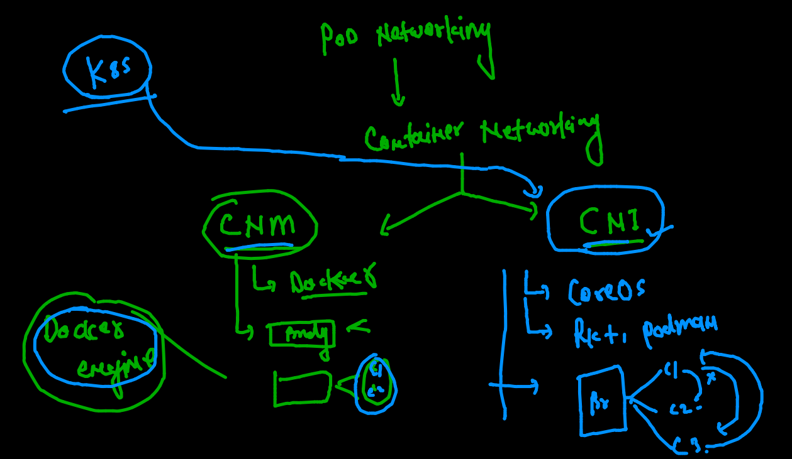

### COntainer Network internface by Calico 

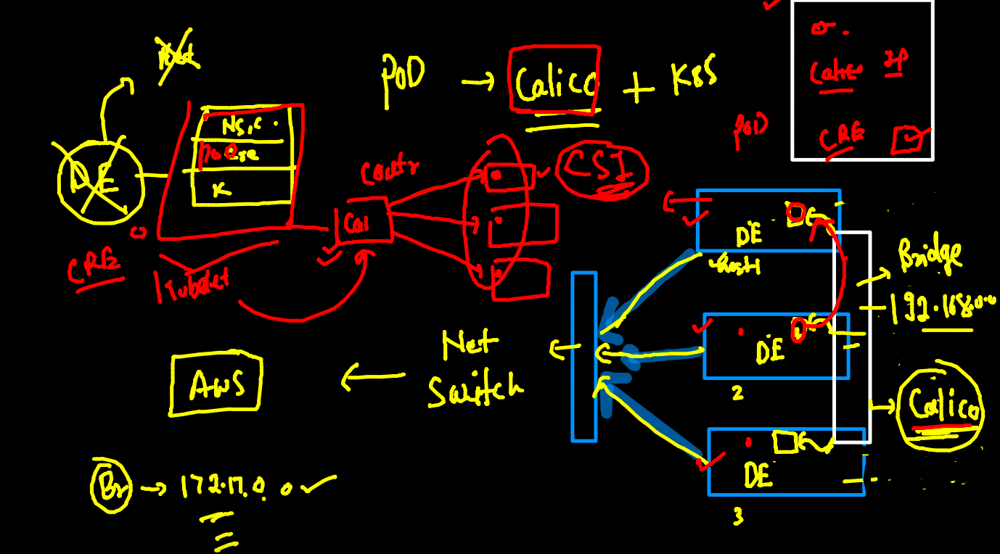

### Intro to service 

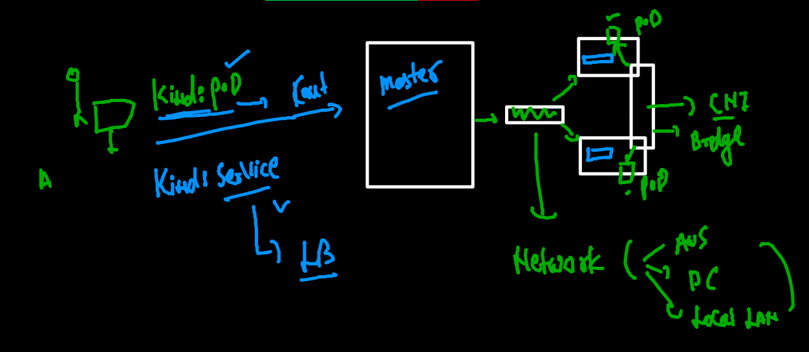

### service type

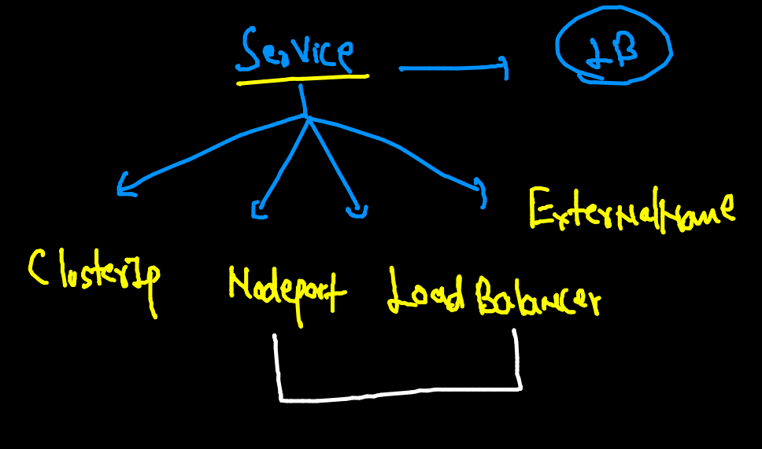

### service can't user name or IP port of POds to connect 

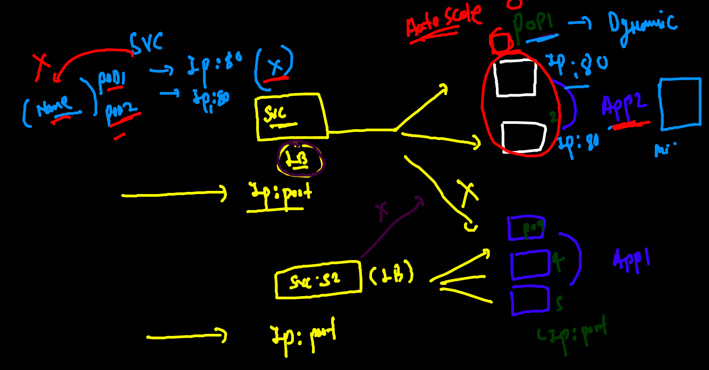

### service will use label to find pods

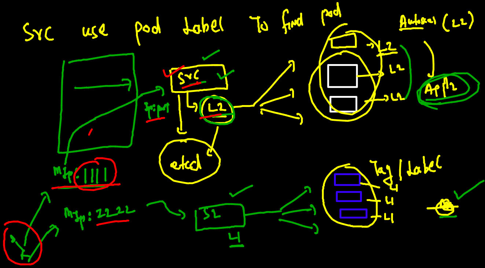

### checking label of pod

```
fire@ashutoshhs-MacBook-Air  ~/Desktop/k8sapps  kubectl  get  po  ashuwebpod2  --show-labels
NAME          READY   STATUS    RESTARTS   AGE   LABELS
ashuwebpod2   1/1     Running   0          22m   x=helloashu1

```

### nodeport service 

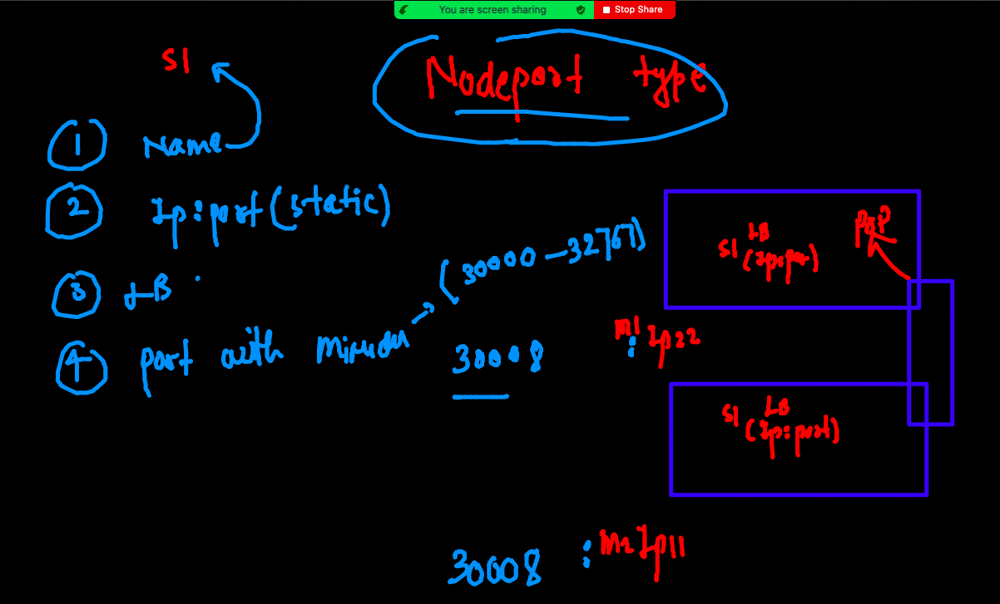

###  creating nodeport 

```
fire@ashutoshhs-MacBook-Air  ~/Desktop/k8sapps  kubectl  create  service 
Create a service using specified subcommand.

Aliases:
service, svc

Available Commands:
  clusterip    Create a ClusterIP service.
  externalname Create an ExternalName service.
  loadbalancer Create a LoadBalancer service.
  nodeport     Create a NodePort service.

Usage:
  kubectl create service [flags] [options]

Use "kubectl <command> --help" for more information about a given command.
Use "kubectl options" for a list of global command-line options (applies to all commands).
 ✘ fire@ashutoshhs-MacBook-Air  ~/Desktop/k8sapps  kubectl  create  service nodeport  ashusvc1  --tcp  1234:80   --dry-run=client -o yaml 


```

### matching service selector -- to label of pod

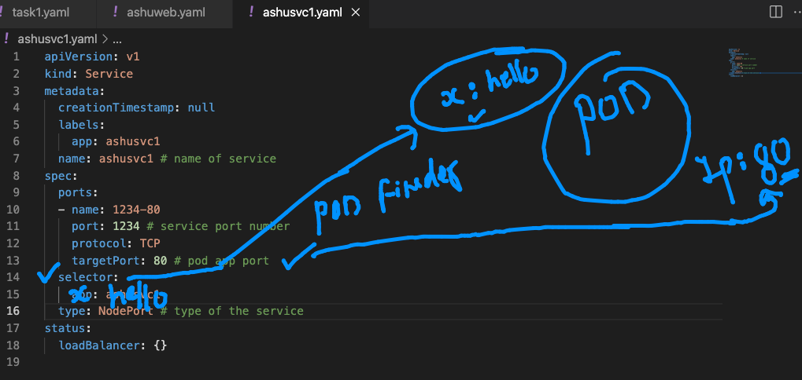

### deploy service 

```
fire@ashutoshhs-MacBook-Air  ~/Desktop/k8sapps  ls
ashupod1.yaml ashusvc1.yaml ashuweb.yaml  logs.txt      task1.yaml
 fire@ashutoshhs-MacBook-Air  ~/Desktop/k8sapps  kubectl apply -f  ashusvc1.yaml 
service/ashusvc1 created
 fire@ashutoshhs-MacBook-Air  ~/Desktop/k8sapps  
 fire@ashutoshhs-MacBook-Air  ~/Desktop/k8sapps  
 fire@ashutoshhs-MacBook-Air  ~/Desktop/k8sapps  kubectl  get  service 
NAME              TYPE        CLUSTER-IP      EXTERNAL-IP   PORT(S)          AGE
ashusvc1          NodePort    10.111.181.4    <none>        1234:32596/TCP   8s
ashutoshsvc1      NodePort    10.101.87.183   <none>        1555:32197/TCP   1s
kubernetes        ClusterIP   10.96.0.1       <none>        443/TCP          23h
vinuthaservice1   NodePort    10.104.116.62   <none>        1230:31715/TCP   15s
 fire@ashutoshhs-MacBook-Air  ~/Desktop/k8sapps  


```

### delete all pods and service 

```
kubectl  delete  all  --all
pod "anshulp1" deleted
pod "arpod-http-1" deleted
pod "arpod-http-2" deleted
pod "ashutoshwebpod1" deleted
pod "ashutoshwebpod2" deleted

```

### history 

```
 kubectl  run  ashuwebpod1  --image=dockerashu/oraclehttpd:29sep2021\n   --port  80 --dry-run=client  -o  yaml 
 4786  history
 4787  kubectl  run  ashuwebpod1  --image=dockerashu/oraclehttpd:29sep2021  --port  80 --dry-run=client  -o  yaml   >ashuweb.yaml 
 4788  history
 4789  kubectl  apply -f  ashuweb.yaml
 4790  kubectl  get  po
 4791  kubectl  apply -f  ashuweb.yaml
 4792  kubectl  get  po
 4793  kubectl  get  po -o wide
 4794  history
 4795  kubectl get  po 
 4796  kubectl describe pod anshulp1
 4797  kubectl  get  po 
 4798  history
 4799  kubectl  get  po 
 4800  kubectl  port-forward   1122:80   ashuwebpod2 
 4801  kubectl  port-forward     ashuwebpod2   1122:80 
 4802  kubectl  get  po 
 4803  kubectl  delete  pods --all
 4804  ls
 4805  kubectl apply -f  ashuweb.yaml
 4806  kubectl get  po 
 4807  history
 4808  kubectl apply -f  ashuweb.yaml
 4809  kubectl  get  po 
 4810  kubectl  get  po  ashuwebpod2 
 4811  kubectl  get  po  ashuwebpod2  --show-labels
 4812  kubectl  create  service 
 4813  kubectl  create  service nodeport  ashusvc1  --tcp  1234:80   --dry-run=client -o yaml 
 4814  kubectl  create  service nodeport  ashusvc1  --tcp  1234:80   --dry-run=client -o yaml  >ashusvc1.yaml
 4815  ls
 4816  kubectl apply -f  ashusvc1.yaml
 4817  kubectl  get  service 
 4818  history
 4819  kubectl  get  service 
 4820  kubectl  get  po 
 4821  kubectl  version 
 4822  history
 4823  kubectl  get  svc
 4824  kubectl  get  po 
 4825  kubectl  delete  all  --all
 4826  ls
 4827  kubectl  apply -f  ashufinalapp.yaml
 
 ```
 
 

