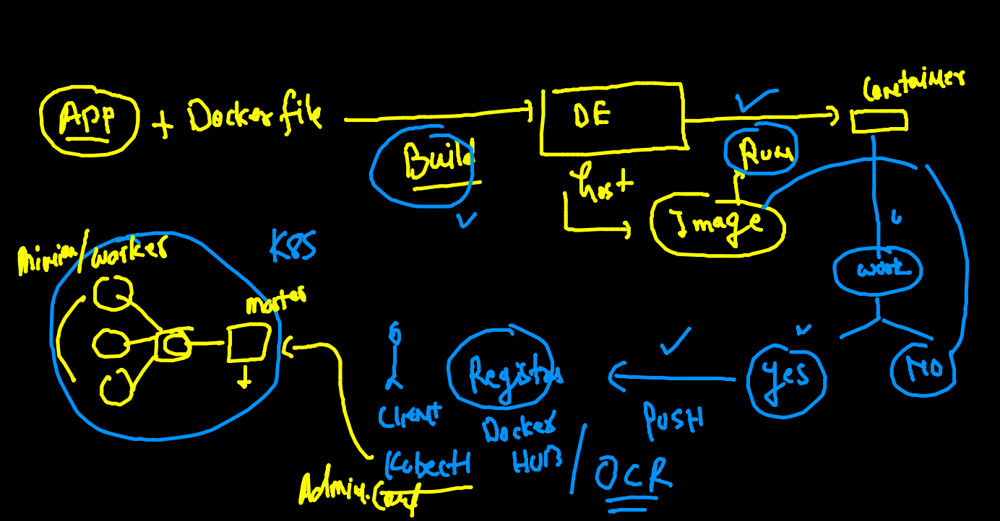

# training docker & kubernetes plan 


## Docker Revision 



## httpd based webapplication contaienrization 


## Systemd is not supported by Docker COntainer 


## building docker image of httpd app server

```
ashu@ip-172-31-81-194 ashuimages]$ ls
cppapp  html-sample-app  javaapp  pythonapp
[ashu@ip-172-31-81-194 ashuimages]$ cd  html-sample-app/
[ashu@ip-172-31-81-194 html-sample-app]$ ls
assets      elements.html  html5up-phantom.zip  images      LICENSE.txt
Dockerfile  generic.html   httpd.dockerfile     index.html  README.txt
[ashu@ip-172-31-81-194 html-sample-app]$ docker  build  -t  dockerashu/oraclehttpd:29sep2021 -f httpd.dockerfile  . 
Sending build context to Docker daemon  2.099MB
Step 1/6 : FROM oraclelinux:8.4
 ---> fcf3cbfc22ac
Step 2/6 : LABEL  email=ashutoshh@linux.com
 ---> Running in 05be72a110ff
Removing intermediate container 05be72a110ff
 ---> bc502292a030
Step 3/6 : RUN  yum  install httpd -y
 ---> Running in a0fdf2add807
Oracle Linux 8 BaseOS Latest (x86_64)            58 MB/s |  36 MB     00:00    
Oracle Linux 8 Application Stream (x86_64)       77 MB/s |  27 MB     00:00    

```

### creating container 

```
[ashu@ip-172-31-81-194 html-sample-app]$ docker  run -d -p 5555:80  dockerashu/oraclehttpd:29sep2021
670a6fac7b1ebbfc4fee9ad2f41e2ba5990828b1ff0e3402adb7213a2ba73dec
[ashu@ip-172-31-81-194 html-sample-app]$ docker  ps
CONTAINER ID   IMAGE                              COMMAND                  CREATED         STATUS         PORTS                                   NAMES
670a6fac7b1e   dockerashu/oraclehttpd:29sep2021   "/bin/sh -c 'httpd -…"   3 seconds ago   Up 2 seconds   0.0.0.0:5555->80/tcp, :::5555->80/tcp   sad_albattani

```

### push 

```
266  docker login 
  267  docker  push  dockerashu/oraclehttpd:29sep2021
  268  docker logout 
  
```

### Docker client options 


### webui for docker 


### portainer webui 

```
 docker  run -d --name  webui -p 9000:9000 -v  /var/run/docker.sock:/var/run/docker.sock  portainer/portainer
 
```
### Storage in Container 


### checking container ephemral nature 

```
[ashu@ip-172-31-81-194 html-sample-app]$ docker  run -it --name  x1  alpine  sh 
/ # ls
bin    dev    etc    home   lib    media  mnt    opt    proc   root   run    sbin   srv    sys    tmp    usr    var
/ # mkdir hello world 
/ # ls
bin    etc    home   media  opt    root   sbin   sys    usr    world
dev    hello  lib    mnt    proc   run    srv    tmp    var
/ # echo hellooo  >a.txt
/ # ls
a.txt  dev    hello  lib    mnt    proc   run    srv    tmp    var
bin    etc    home   media  opt    root   sbin   sys    usr    world
/ # exit
[ashu@ip-172-31-81-194 html-sample-app]$ docker  rm x1
x1
[ashu@ip-172-31-81-194 html-sample-app]$ docker  run -it --name  x1  alpine  sh 
/ # ls
bin    dev    etc    home   lib    media  mnt    opt    proc   root   run    sbin   srv    sys    tmp    usr    var
/ # exit
[ashu@ip-172-31-81-194 html-sample-app]$ docker  rm x1
x1

```

### docker volume 

```
[ashu@ip-172-31-81-194 html-sample-app]$ docker  volume   create   ashuvol1
ashuvol1
[ashu@ip-172-31-81-194 html-sample-app]$ docker  volume  ls
DRIVER    VOLUME NAME
local     7c330769a34b461af7c22cba04c7499b8d86ad684fa0640e5089c8d92f55a4e9
local     8e2803d4354367a558b69b0aa1cda60562d8024eaabc0f48f0c942d3af23c850
local     010f6b1710a6ded49d0fec2c5fbc33e8c135107fb73677c859552a23b03b2996
local     95d11979e89e2bba5e495f2c2d619c9e3f5c8a2ecff94e06573122b0f1b5d5d8
local     512148dfe78f61ad8eea99e3bf5805f6b8de0d6ea4e960b9579ac3e083d2160f
local     723650c83f5c72552a96e36045d0b9c7c87462a6e3e8586fe54652b0c3b868cf
local     acbd9034ad0dfa71d99d78fdedb36d18cb6c882455200ca59bb7b66729b9b16c
local     ashuvol1
[ashu@ip-172-31-81-194 html-sample-app]$ docker  volume  inspect  ashuvol1
[
    {
        "CreatedAt": "2021-09-29T06:14:26Z",
        "Driver": "local",
        "Labels": {},
        "Mountpoint": "/var/lib/docker/volumes/ashuvol1/_data",
        "Name": "ashuvol1",
        "Options": {},
        "Scope": "local"
    }
]

```

### creating a volumed container 

```
[ashu@ip-172-31-81-194 html-sample-app]$ docker  run  -itd --name ashuc1  -v  ashuvol1:/mnt/ashudata:rw  alpine 
a9e9d3c2288b79020d825899fb09b3ea915d0ce2dbe256d1349bb070c5510df4
[ashu@ip-172-31-81-194 html-sample-app]$ docker  ps
CONTAINER ID   IMAGE     COMMAND     CREATED         STATUS         PORTS     NAMES
a9e9d3c2288b   alpine    "/bin/sh"   7 seconds ago   Up 6 seconds             ashuc1
[ashu@ip-172-31-81-194 html-sample-app]$ docker  exec  -it  ashuc1  sh 
/ # cd  /mnt/
/mnt # ls
ashudata
/mnt # cd ashudata/
/mnt/ashudata # ls
/mnt/ashudata # mkdir  hello world 
/mnt/ashudata # echo hello world th is me  >oracle.txt
/mnt/ashudata # ls
hello       oracle.txt  world
/mnt/ashudata # exit

```

### volume on docker engine side 

```
2-user@ip-172-31-81-194 ~]$ sudo -i
[root@ip-172-31-81-194 ~]# 
[root@ip-172-31-81-194 ~]# 
[root@ip-172-31-81-194 ~]# 
[root@ip-172-31-81-194 ~]# cd  /var/lib/docker/
[root@ip-172-31-81-194 docker]# ls
buildkit    image    overlay2  runtimes  tmp    volumes
containers  network  plugins   swarm     trust
[root@ip-172-31-81-194 docker]# cd  volumes/
[root@ip-172-31-81-194 volumes]# ls
010f6b1710a6ded49d0fec2c5fbc33e8c135107fb73677c859552a23b03b2996  ashuvol1
512148dfe78f61ad8eea99e3bf5805f6b8de0d6ea4e960b9579ac3e083d2160f  backingFsBlockDev
723650c83f5c72552a96e36045d0b9c7c87462a6e3e8586fe54652b0c3b868cf  mallikvol1
7c330769a34b461af7c22cba04c7499b8d86ad684fa0640e5089c8d92f55a4e9  manjuvol1
8e2803d4354367a558b69b0aa1cda60562d8024eaabc0f48f0c942d3af23c850  metadata.db
95d11979e89e2bba5e495f2c2d619c9e3f5c8a2ecff94e06573122b0f1b5d5d8  nitavol0
acbd9034ad0dfa71d99d78fdedb36d18cb6c882455200ca59bb7b66729b9b16c  phanivol1
anshulvol1                                                        preevol1
arun                                                              pujithavol1
arun1                                                             sanjay_volume_1
ashutoshvol1                                                      vinuthavol1
[root@ip-172-31-81-194 volumes]# cd  ashuvol1/
[root@ip-172-31-81-194 ashuvol1]# ls
_data
[root@ip-172-31-81-194 ashuvol1]# cd  _data/
[root@ip-172-31-81-194 _data]# ls
hello  oracle.txt  world
[root@ip-172-31-81-194 _data]# 

```


