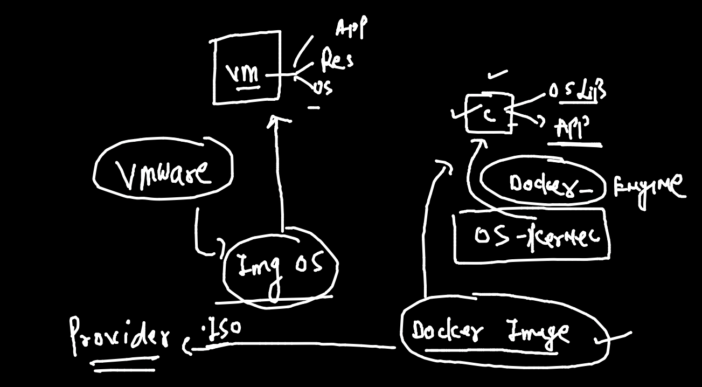

# training docker & kubernetes plan 


## some assumption 


## app deployment / compatilibity 


## physical machines replaced with virtual machine 


## problem with VM concept 


## Solution is container



## Understanding OS 


## what is container 


## cre vs vm


## Docker info 

### installation info 


## Docker Desktop in windows / mac system 


## Installing docker Dekstop on MAC OS

### Download link 

[Link](https://hub.docker.com/editions/community/docker-ce-desktop-mac)

## Installing docker Dekstop on Windows 10 

[LInk]

## what exactly docker Dekstop do on a linux VM 

```
[root@ip-172-31-81-194 ~]# history 
    1  yum   install  docker  -y  # same OL / RHEL 
    2  history 
[root@ip-172-31-81-194 ~]# 
[root@ip-172-31-81-194 ~]# 
[root@ip-172-31-81-194 ~]# systemctl start  docker 
[root@ip-172-31-81-194 ~]# systemctl enable  docker 
Created symlink from /etc/systemd/system/multi-user.target.wants/docker.service to /usr/lib/systemd/system/docker.service.
[root@ip-172-31-81-194 ~]# systemctl status  docker 
● docker.service - Docker Application Container Engine
   Loaded: loaded (/usr/lib/systemd/system/docker.service; enabled; vendor preset: disabled)
   Active: active (running) since Mon 2021-09-27 06:30:37 UTC; 13s ago
     Docs: https://docs.docker.com
 Main PID: 3661 (dockerd)
   CGroup: /system.slice/docker.service
           └─3661 /usr/bin/dockerd -H fd:// --containerd=/run/containerd/containerd.sock --default-ulimit nofile=32768:65536

Sep 27 06:30:36 ip-172-31-81-194.ec2.internal dockerd[3661]: time="2021-09-27T06:30:36.823592857Z" level=info msg="scheme...grpc
Sep 27 06:30:36 ip-172-31-81-194.ec2.internal dockerd[3661]: time="2021-09-27T06:30:36.823609934Z" level=info msg="ccReso...grpc
Sep 27 06:30:36 ip-172-31-81-194.ec2.internal dockerd[3661]: time="2021-09-27T06:30:36.823621298Z" level=info msg="Client...grpc
Sep 27 06:30:36 ip-172-31-81-194.ec2.internal dockerd[3661]: time="2021-09-27T06:30:36.874689834Z" level=info msg="Loadin...rt."
Sep 27 06:30:37 ip-172-31-81-194.ec2.internal dockerd[3661]: time="2021-09-27T06:30:37.374241727Z" level=info msg="Defaul...ess"
Sep 27 06:30:37 ip-172-31-81-194.ec2.internal dockerd[3661]: time="2021-09-27T06:30:37.593818203Z" level=info msg="Loadin...ne."
Sep 27 06:30:37 ip-172-31-81-194.ec2.internal dockerd[3661]: time="2021-09-27T06:30:37.648980283Z" level=info msg="Docker...10.7
Sep 27 06:30:37 ip-172-31-81-194.ec2.internal dockerd[3661]: time="2021-09-27T06:30:37.649091188Z" level=info msg="Daemon...ion"
Sep 27 06:30:37 ip-172-31-81-194.ec2.internal systemd[1]: Started Docker Application Container Engine.
Sep 27 06:30:37 ip-172-31-81-194.ec2.internal dockerd[3661]: time="2021-09-27T06:30:37.690919057Z" level=info msg="API li...ock"
Hint: Some lines were ellipsized, use -l to show in full

```

### official link to Install docker on different OS Platform 

[link_install](https://docs.docker.com/engine/install/)


